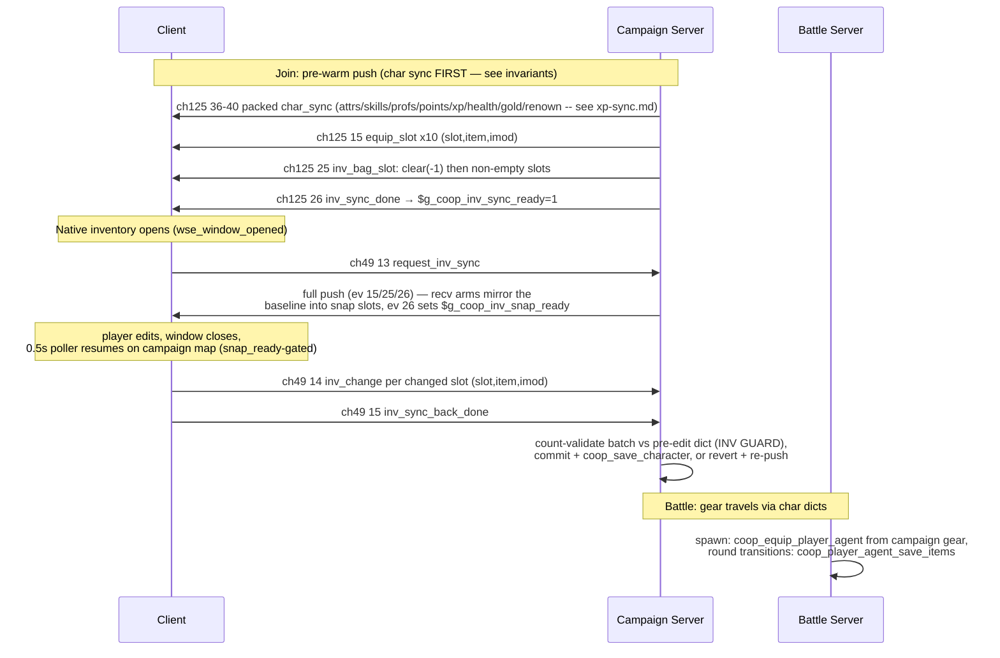

# Flow: Inventory Sync (equip pushes, bag sync, screen close-diff)

**Status:** AUDITED
**Validated against commit:** `ce0e287` (steamid persistence,
runtime-verified 2026-08-23: char-dict naming is sid-keyed for
Steam-identified players and the join-time pre-warm push now fires from
`coop_player_hydrate` (ch49 identify / 5 s fallback), not the join handler;
this flow's own events are unaffected. Prior stamp `9681486`: the join-time
char sync this dossier's sequence diagram references is now 5 packed
messages, ch125 ev 36-40, not the old per-value events 16-24 — see
`xp-sync.md` for the char-sync detail; this flow's own events (15/25/26,
ch49 13/14/15) are unaffected. Prior: `9558722`, B2 push-on-mutation + B3
receive-handler baseline runtime smoke passed 2026-07-25, incl. the
smoke-session trade-purchase fix `6c4db5c`; row 6 fix + join-push
ordering 2026-07-10, group-C rows 4/5 2026-07-11)

## Scope

How a player's equipment (slots 0–9) and bag (slots 10–105) stay in sync
between the campaign server's authoritative troop struct and the client's
native inventory screen, and how gear reaches the battle server. Entry
points: campaign join (pre-warm push), native inventory window open/close,
battle spawn. Exit state: server troop + the per-player char dict
(`coop_char_sid_<acctid>` / `coop_char_<name>`, see key-builders) reflect
client edits. The trade screen has its own synced flow (ch49 ev 20–22 /
ch125 ev 29–32) and is out of scope here.

Module paths relative to `wse2work/Native-Coop-master/`.

## Sequence diagram

## Code anchors

| # | Step | File | Line | Symbol |
|---|------|------|------|--------|
| 1 | Equip push on join (ev 15) | `module_coop_scripts.py` | 9637–9646 | `coop_send_equipment_to_client` |
| 2 | Bag push on join (ev 25/26, clear signal, non-empty only) | `module_coop_scripts.py` | 9648–9676 | `coop_send_inventory_to_client` |
| 3 | Push call sites (join) | `module_coop_scripts.py` | 8221–8222 | `multiplayer_campaign_player_joined` |
| 4 | Client equip recv (troop struct + mirror) | `module_coop_scripts.py` | 8448–8459 | ev 15 arm (mirror writes raw slots 0–19 — see audit row 4) |
| 5 | Client bag recv + sync-ready flag | `module_coop_scripts.py` | 6839–6861 | `coop_client_recv_inventory` (`$g_coop_inv_sync_ready`) |
| 6 | Open-time snapshot baseline | `module_scripts.py` | 51154–51188 | `wse_window_opened` (window_inventory arm) |
| 7 | Presentation-side baseline (coop item select) | `module_presentations.py` | 13630–13660 | on `$g_coop_inv_sync_ready` |
| 8 | Close-diff + send (equip then bag) | `module_simple_triggers.py` | 4541–4600 | 0.5s poller, ev 14 per changed slot, ev 15 done |
| 9 | Server apply (no validation) + save | `module_coop_scripts.py` | 8759–8771 | ev 13/14/15 arms |
| 10 | Char dict save/load carries imod | `module_coop_scripts.py` | 7162–7173, 7380–7399 | in `coop_save_character` / `coop_load_character` |
| 11 | Battle server: pre-spawn inventory access | `module_coop_scripts.py` | 2973–3001 | `coop_player_access_inventory` |
| 12 | Battle server: spawn equip from campaign gear | `module_coop_scripts.py` | 3025–3044 | `coop_equip_player_agent` |
| 13 | Battle server: persist agent items at round transition | `module_coop_scripts.py` | 3002–3024 | `coop_player_agent_save_items` |
| 14 | Battle server: item-bug guard | `module_coop_scripts.py` | 3045–3087 | `coop_check_item_bug` |

## State & events

- **Events:** ch125: `equip_slot`=15, `inv_bag_slot`=25, `inv_sync_done`=26;
  ch49: `request_inv_sync`=13 (re-added deliberately by B3 `2f2f2bc` per
  the C7 note — client sends on screen open, server replies with the full
  push), `inv_change`=14, `inv_sync_back_done`=15 (`header_common.py`).
- **Client globals:** `$g_coop_inv_screen_open` (0 idle / 1 open / 2 close
  processed; set by `wse_window_opened`), `$g_coop_inv_sync_ready`,
  `$g_coop_inv_snap_ready` (baseline mirrored — close-diff may run; set by
  ev 26, cleared when the diff fires or a trade close suppresses it).
- **Snapshot slots** on `trp_temp_troop`: equip items 160–169, equip mods
  170–179, bag items 180–275, bag mods 276–371
  (`module_constants.py:1944–1947`).
- **Dict:** equipment + bag with imods persisted per player in the char
  dict (`coop_char_sid_<acctid>.wsedict` for Steam-identified players,
  `coop_char_<name>.wsedict` otherwise — naming owned by the
  `coop_char_store_dict_name[_raw]` key-builders since `ce0e287`) by
  `coop_save_character`.

## Invariants

- Slots 0–9 are equipment, 10–105 bag; the bag push sends a clear signal
  (slot −1) before non-empty slots to purge stale client state without
  overflowing the send buffer (`:9654–9660`).
- Every `inv_sync_back_done` triggers a char-dict save — client edits are
  never left memory-only on the server (`:8770–8771`).
- Simple triggers pause during native windows, so `open==1` observed by the
  poller means "the screen just closed" (`module_simple_triggers.py:4541`).
- Item modifiers travel with every hop: ev 14/15/25 payloads and the char
  dict all carry imod.
- **The equip_slot/inv_bag_slot receive handlers must never unconditionally
  overwrite `trp_player` while the inventory screen is open.** `trp_player`
  is the live edit surface the native UI writes to; `wse_window_opened`
  requests a fresh `request_inv_sync` on every open but does not wait for
  the reply before letting the native window open. If that reply's push
  messages (ev 15/25) arrive after the player has already equipped/moved
  something, an unconditional mirror write silently overwrites the edit
  before the close-diff ever runs — the diff then finds nothing to send
  (an "accepted" empty batch), while the native UI still visually shows the
  edit (drawn instantly, client-local) until the player interacts with a
  slot and the true, un-edited data is revealed. Fixed by
  `coop_inv_recv_mirror_ok`: while `$g_coop_inv_screen_open == 1`, only
  mirror-write `trp_player` for a slot if it still matches the *previous*
  snapshot there (untouched since the last confirmed baseline); outside an
  open screen (hydrate, battle result, loot) always mirror unconditionally,
  since there is no in-progress edit to protect there.
- **Slot 9 (`ek_food`) is a real equipment slot and must be persisted like
  0-8.** It was pushed to clients (ev 15) and included in the close-diff
  snapshot and INV GUARD baseline/revert, but `coop_save_character` /
  `coop_load_character` excluded it from the char dict, so it silently
  reset to the troop template's default on every reconnect even though
  live-session edits to it appeared to work. Fixed: save/load and the INV
  GUARD count/revert loops now cover slots 0-9; `coop_load_character`
  has_key-guards `@char_itm_9`/`@char_imd_9` for dicts saved before this
  fix.
- **Join push order: char sync before inventory.** The engine bounds
  `troop_set_inventory_slot` by `getNumInventorySlots()+10` — skill-derived
  (`30 + 6*IM` for hero troops), silent no-op out of range
  (`patches/Warband_WSE2/findings.md` "troop inventory slot bounds"). If bag
  slots arrive before the skill push raises the client troop's IM, the
  IM-bonus slots (e.g. 40–45 at IM 1) are dropped client-side — items
  "disappear on rejoin" while remaining in the server dict. Fixed by
  reordering `multiplayer_campaign_player_joined` pushes (char sync →
  equipment → inventory), mirroring `coop_load_character`'s skills-before-bag
  order; runtime-verified 2026-07-10.

## Audit: ours vs. native

| # | Behavior | Ours (anchor) | Native ground truth (evidence) | Verdict |
|---|----------|---------------|--------------------------------|---------|
| 1 | Server-side inventory mutations (quest rewards, script grants) are pushed to the client only on join/rejoin — there is no push-on-mutation path | pushes exist only at `:8221–8222` (join) | The mod's own documented authority model ("clients receive pushes") implies server mutations should reach a live client; in native SP the question doesn't arise (single process). | OK (fixed B2 `87f4c82`: `coop_push_player_inventory` = single push-on-mutation contract, unified join/creation/INV-GUARD call sites; trade purchases applied server-side + pushed at trade_done `6c4db5c`; runtime smoke 2026-07-25) |
| 2 | Close-diff baseline is an **open-time snapshot of the client troop**, ungated | was `module_scripts.py` `wse_window_opened` snapshot loops, ungated poller diff | The char-sync flow implements the documented lesson ("baseline must come from receive handlers, not client troop") with a `snap_ready` gate; the inventory flow predated/skipped it. | OK (fixed B3 `75e9a57`: open sends ev 13, recv arms 15/25 mirror the baseline into the snap slots, ev 26 sets `$g_coop_inv_snap_ready`, poller diff gated char-sync-style; runtime smoke 2026-07-25) |
| 3 | Battle equip: gear rebuilt from campaign state on spawn; consumables not decremented in campaign inventory after battle | `module_coop_scripts.py:3025–3044`, `:3002–3024` | Native refills ammo/consumables after battles (campaign inventory is not charge-tracked) — rebuilding from campaign state yields the same net behavior | OK |
| 4 | Orphaned raw-slot 0–19 mirror deleted from the ev-15 recv arm (`1dc8fec`); the troop-struct writes that feed the native inventory screen remain. Smoke passed 2026-07-11 | ev-15 recv arm, `module_coop_scripts.py` | The actual diff baseline lives at slots 160–179 (`module_constants.py:1944–1945`), written by `wse_window_opened`/presentation — nothing read the raw-slot mirror | OK |
| 5 | ch49 ev 13 `request_inv_sync` constant + handler deleted (`1dc8fec`) — no sender existed; inventory is pre-warmed on join. Project-state row corrected (ID 13 marked free). Smoke passed 2026-07-11 | `header_common.py` (ID 13 free note) | If B2 (push-on-mutation) ever needs a client re-request, add one deliberately in that design | OK |
| 7 | Slot 9 (`ek_food`) pushed/diffed/guarded over the network but never written to the char dict by save/load -- resets to troop-template default on every reconnect | `module_coop_scripts.py` save ~8210-8221, load ~8578-8598 | Native engine treats slot 9 as a real equipment slot (`header_items.py:120 ek_food=9`); the mod's own contract (network push, close-diff baseline, INV GUARD) already treated it as persistent gear | OK (fixed 2026-09-06: save/load loops extended to 0-9; INV GUARD count/revert loops extended to match; load has_key-guards the slot-9 keys for pre-fix dicts) |
| 6 | Server applies `inv_change` verbatim — any item/imod a client names lands in the server troop and is persisted | `module_coop_scripts.py:8762–8768` | Violates the mod's server-authoritative design statement; a buggy or malicious client can mint arbitrary items (contrast: battle drops are slot-guarded server-side, `coop_generate_item_drop:9704–9706` "we hold the item in a slot, server-side, to prevent funny business") | OK (fixed `50f4ac1`: `coop_inv_sync_back_validate_and_save` count-validates each batch against the pre-edit dict baseline, commits or reverts whole batch; runtime-verified 2026-07-10 — legit edits stick, no false `[INV GUARD]` rejects) |
| 8 | `coop_ev_cli_inv_change`/`coop_ev_cli_trade_change` validated item ids against `all_items_begin..all_items_end` (`module_constants.py`: `all_items_end = "itm_items_end"`, the **native** item table boundary) instead of the wider `coop_new_items_end` `coop_load_character` already uses for the same purpose. `module_items.py` does define entries past `itm_items_end` (up to `itm_ccoop_new_items_end`), so this range mismatch is real and independently worth fixing, but it was **not** the cause of the user-reported "equip resets on close" bug investigated in row 9 below — user confirmed the items involved were plain native items, not custom ones. Left fixed as a correctness improvement, not because it explained the reported symptom. | `module_coop_scripts.py` `inv_change` arm, `coop_ev_cli_trade_change` | `coop_load_character` already uses the correct wider range for the exact same item-validity purpose | OK (fixed 2026-09-06: both arms now use `is_between :item 1 coop_new_items_end`; harmless/correct either way, but confirmed not the reported bug's cause) |
| 9 | **The actual cause of "equip a weapon/horse, close inventory, it resets" (confirmed via user repro + server log)**: the equip_slot/inv_bag_slot receive handlers (ev 15/25) unconditionally overwrote `trp_player` (the live native-UI edit surface) on every push, including the push `wse_window_opened` requests on every open. That request's reply arrives asynchronously; if it lands *after* the player has already equipped/moved something in the now-open screen, the unconditional mirror write silently reverted `trp_player` back to the pre-edit value before the close-diff ever ran. The diff then found nothing to send (server log showed `[INV GUARD] ...: accepted inventory batch` — an empty, no-op "acceptance," not a rejection), while the native UI still visually showed the edit (drawn instantly and locally) until the player clicked a slot and the real, never-actually-changed data was revealed — exactly the "looks equipped, bag looks empty, but clicking the bag slot picks the item up" symptom reported. | `module_coop_scripts.py`: `server_event_equip_slot` recv arm (~11797), `server_event_inv_bag_slot` recv arm (~7864, both the clear-signal and per-slot branches) | This is the same class of bug the char-sync flow already fixed for itself (row 2 here, and the analogous char-sync lesson): a receive-handler baseline must not be allowed to clobber an in-progress local edit. Inventory had the *baseline* half of that lesson applied (row 2) but not the *don't overwrite mid-edit* half. | OK (fixed 2026-09-06: new `coop_inv_recv_mirror_ok` helper — while `$g_coop_inv_screen_open == 1`, only mirror-write `trp_player` for a slot if it still matches the previous snapshot there; outside an open screen, mirror unconditionally as before, since there's no in-progress edit to protect. Still not confirmed as of the next round of feedback — see row 10.) |
| 10 | **A second, independent bug found from the row-9 fix's own follow-up log**: `coop_inv_client_diff_and_send`'s reconcile and diff loops iterated bag slots 10-105 unconditionally, but the engine bounds `troop_get/set_inventory_slot` by `getNumInventorySlots()+10` = `40 + 6*IM` (skill-derived, same limit already documented in the Invariants section for the join-push-order fix) — for a low-Inventory-Management character (confirmed: level 2, cap exactly 40), every slot from 40 up reads back garbage/empty regardless of what the server actually holds there, so the diff spuriously "detected" all of them as cleared to `item=-1, imod=-1` on **every single close**, unrelated to what the player actually did. The `imod` validity check (`is_between 0 43`, no `-1` escape unlike the `item` check) then rejected every one of these bogus clears — accidentally protective (an accepted version would have wiped real server-side bag data the low-IM client simply can't perceive), but flooded the log and obscured whatever the real equip-slot diff was doing. | `module_coop_scripts.py` `coop_inv_client_diff_and_send` (both bag loops), `inv_change`/`coop_ev_cli_trade_change` imod checks | Same class of bug as the already-documented IM-slot-bound note in Invariants, just hitting the close-diff path instead of the join-push path | OK (fixed 2026-09-06: diff loops now clamp the bag range to `10..bag_cap` where `bag_cap = min(106, 40 + 6*IM)`, computed from the character's live Inventory Management skill, so slots beyond current capacity are never touched; `imod` checks in both arms now accept `-1` paired with `item=-1` for genuine clears within the valid range. Not yet playtest-confirmed — and does not by itself confirm whether row 9's mirror-clobber fix resolved the original equip-slot symptom, since the follow-up log showed no rejection for slots 0-9 either way.) |
| 11 | **The actual root cause of "equip resets" (found by the user, not by log analysis): a fast close-then-reopen of the inventory window loses the close entirely.** Close detection has no native "window closed" engine hook to rely on — it's a poller (`module_simple_triggers.py`) inferring "the window just closed" purely from observing `$g_coop_inv_screen_open` still `== 1` on a live tick (simple triggers only run on the free campaign map, so a native window being open normally pauses them, making that observation reliable). But `wse_window_opened` is a real-time engine callback, not throttled by the poller's own interval — if the player closes and reopens fast enough, the *second* open's callback fires before the poller ever gets a tick to observe the intermediate closed state, so `script_coop_inv_client_diff_and_send` (the only thing that ever sends the equip change) never runs for the first session at all. The equip is silently discarded, and the second open's own fresh `request_inv_sync` reply then overwrites everything with the server's original, never-updated data. This is why rows 9 and 10's fixes were real but insufficient on their own: there was nothing wrong with the diff/guard/mirror logic in the fast-reopen case, because the diff call was never being made in the first place. | `module_scripts.py` `wse_window_opened` (all three of `window_inventory`/`window_party`/`window_character` shared this exact pattern) | Same root cause class as rows 2 and 9 (a stale-vs-live-edit hazard around this poller-based close detection), but this is the detection mechanism itself failing to fire at all, not a downstream handler mishandling data it received | OK (fixed 2026-09-06: each window-open branch now checks whether the previous session was left open (`screen_open == 1`, with the same `snap_ready`-gate the poller itself uses) and, if so, synchronously flushes that session's diff — `coop_inv_client_diff_and_send` / `coop_party_client_diff_and_send` / `coop_char_client_diff_and_send` — before resetting state for the new open. This engine callback isn't throttled by the poller's interval, so it catches the fast-reopen case the poller structurally cannot. Root cause found and reported by the user, not diagnosed from a log.) |
| 12 | **Distinct bug, same complaint family: equipping a horse doesn't visually mount the player on the campaign map icon.** First hypothesis (remove/re-add the hero from their own party to "poke" the engine) was tried with the user's explicit sign-off on the uncertainty and **confirmed ineffective** by a follow-up log showing the equip itself now working correctly (slot 8 applied, batch accepted, saved) with no change to the map icon. Root cause actually found by narrowing the symptom with the user (map icon specifically wrong; speed/scenes/combat not reported wrong) and searching for exactly how native sets a party's map icon: `module_simple_triggers.py` "Updating player icon in every frame" (`(0, [(neg|game_in_multiplayer_mode), ...])`, per-frame, reads `trp_player`'s horse slot 8, picks `icon_player_horseman`/`icon_player`, calls `party_set_icon("p_main_party", ...)`. This is (a) disabled in multiplayer like everything else of this shape, and (b) targets the wrong party (`p_main_party`, not a coop player's own party) even if it weren't. Every coop player party is created once from a template baked with the walking `icon_player` (`module_parties.py`'s `player_party_%04d` templates) and **nothing has ever updated it since** — this was a true gap, not a regression. | `module_simple_triggers.py:3041-3064`, `module_parties.py:50` | The first (wrong) hypothesis was reasonable given no scriptable party-speed-recalc op exists, but the actual native mechanism turned out to be a simple, ordinary `party_set_icon` call this mod just never replicated for its own player parties — no deep engine RE was actually needed once the symptom was narrowed to "map icon only." | OK (fixed 2026-09-07): new `coop_broadcast_party_map_icon(player_no)` recomputes the icon from the player's live horse slot and broadcasts a new ch125 event (`server_event_party_set_map_icon`, id 63) to every connected client whenever it changes; hooked into `coop_push_player_inventory` (the established "any inventory mutation ends here" contract point — module_coop_scripts.py:14542-14544 — so it fires after equip, loot, trade, and battle-result changes alike, not just manual equip-screen edits). Also pushes every connected player's current icon to a freshly-joining player in `multiplayer_campaign_send_initial_information`, so a new joiner immediately sees everyone's correct mount status instead of waiting for each of them to next touch their inventory. **User confirmed the icon fix worked, but only after the SECOND open+close** — see row 13. |
| 13 | **Icon fix (row 12) only took effect one cycle late.** `coop_inv_sync_back_validate_and_save`'s *accept* branch calls `coop_save_character` but never `coop_push_player_inventory` (only the *revert* branch does) — so `coop_broadcast_party_map_icon`, hooked onto that push contract, never fired on a normal successful close. It only ran on the player's *next* open, via that open's own `request_inv_sync` → push. | `module_coop_scripts.py` `coop_inv_sync_back_validate_and_save` accept branch | Same shape as row 1's original push-on-mutation gap, just for a handler added after that contract was established | OK (fixed 2026-09-07): `coop_broadcast_party_map_icon` is now called directly from the accept branch too, so the icon updates on the same close that changed it. |
| 14 | **Still open: campaign-map movement speed doesn't change when (un)mounting, only the icon does (fixed by row 12/13).** No scriptable party-speed operation exists at all (confirmed by an exhaustive grep of `header_operations.py` for anything speed-related — nothing for parties, only agent/mission/item speed ops, none of which apply here). Two independent script-level workarounds were tried and **both disproven by direct user playtest**: a remove+re-add "poke" of the hero from their own party, tried once as a general post-accept refresh and once specifically coupled to a mount-status flip. | `module_coop_scripts.py` `coop_broadcast_party_map_icon` (removed, both attempts) | Since the one plausible script-level lever (forcing a party-membership-change side effect) has now failed twice for two different symptoms with no scriptable speed operation to fall back on, this most likely requires an actual WSE2 engine-level (C++ patch) change — outside what's reachable from the Python module-script source in this checkout. | **Not fixed; module-script approaches exhausted for now** (2026-09-07). Do not add a third variant of "poke the party and hope speed recalculates" without new evidence. If the user can provide the WSE2 patch/DLL source (referenced by other dossiers as a workbench document not in this repo), that's the more promising next avenue — the real mechanism is very likely compiled into the engine, not something the Python layer can trigger. |

| 15 | **Distinct bug, same complaint family: the post-battle victory loot screen showed items as taken, but they were gone after closing.** `change_screen_loot` (the loot-taking screen, run against `trp_find_item_cheat` -- module_coop_scripts.py `coop_award_local_battle_loot`/`server_event_loot_open`, `:13174-13182`) opens the exact same engine window as the regular equip screen (`window_inventory=7`) -- Warband's loot UI is just the inventory presentation against an alternate troop. The loot flow's own poller (`module_simple_triggers.py`) correctly waits for its own inv-sync baseline before opening the loot menu (`$g_coop_inv_screen_open`/`$g_coop_inv_snap_ready` both already 1 by the time `change_screen_loot` fires), and has its own correct loot-aware close diff gated on `$g_coop_loot_screen_open` (diffs `trp_find_item_cheat` slots 10-21, sends `loot_claim`/`loot_done`). But row 11's fast-reopen fix (`wse_window_opened`'s `window_inventory` case) had no awareness of `$g_coop_loot_screen_open` -- it ran its "flush a stale session" check unconditionally on every `window_inventory` open, including a loot open. The stale-flush diff itself was a harmless no-op there (diffs `trp_player`, the wrong troop for a loot session, nothing's changed on it yet), but it ALSO unconditionally reset `$g_coop_inv_sync_ready`/`$g_coop_inv_snap_ready` to 0 and re-requested `inv_sync` -- forcing a second network round-trip that gated the real loot-close diff shut until it completed. If the player closed the loot screen (or the poller ticked) before that second round-trip landed, the loot-aware close diff simply never ran that tick -- structurally, on every single loot close, not as a rare race. Same root-cause *class* as row 11 (a stale-session guard blind to a sibling session type sharing the same engine window), but a distinct instance the row-11 fix didn't anticipate. | `module_scripts.py` `wse_window_opened` `window_inventory` case (`:51504-51547`ish); loot-aware close diff at `module_simple_triggers.py:5147-5171`; loot-open sequencing at `module_simple_triggers.py:5084-5094` | The loot-open sequencing and loot-aware close diff were both already correct in isolation -- the bug was entirely in row 11's fix not accounting for a second session type (loot) sharing `window_inventory` | OK (fixed 2026-09-08): the stale-flush-diff-and-resync block is now skipped entirely when `$g_coop_loot_screen_open == 1` -- a loot session already manages its own inv-sync state via the poller, so this generic equip-screen handler no longer interferes with it. Not yet playtest-confirmed. |

| 16 | **Distinct bug, different layer entirely: the post-local-fight loot screen (`mnu_coop_claim_battle_loot`, distinct from row 15's post-*dedicated*-battle loot) never opened at all.** A local fight's debrief writes its result to module globals only (`$g_coop_result_*`), never over the network — by design, since a local mission's connection state is not assumed reliable enough for a synchronous send. The client ASI (`coop.c`) persists that to `coop_local_result.ini` on disk, and once the client is back on the campaign server, is supposed to read it back, write `$g_coop_pending_local_result` + friends, and let a `module_simple_triggers.py` poller relay it to the server as `local_fight_result` (which does generate loot via `coop_award_local_battle_loot`, same as any other win). The read-back (`check_pending_local_result` in `coop.c`) only ever ran from frame hooks gated on `mode==4` ("still a raw multiplayer client, not yet on the campaign map") — i.e. it fires from the disconnected browser screen the auto-reconnect briefly passes through, immediately BEFORE the actual campaign-server connect. But the engine wipes all module globals on every connect (an already-established fact this project depends on elsewhere, e.g. the Steam-acctid republish pattern) — so the very write `check_pending_local_result` just made was clobbered by the reconnect it was racing, before `multiplayer_is_campaign` ever became true and the module's own relay trigger got a chance to read it. Never reproducible without a real local-fight-then-reconnect cycle, which nothing exercised until "Fight Locally" was re-enabled and auto-reconnect wired in (this session, 2026-09-10) — the file-based relay design predates both and was apparently never actually exercised end-to-end before. | `src/asi/coop.c` `check_pending_local_result`/`browser_framemove_pre`/`mfm_pre`; relay trigger at `module_simple_triggers.py:471-538` | Same class of lesson as the Steam-acctid comment already documents in `coop.c` ("a module-side startup zero must never stick" — republish every tick instead of writing once) applied to a second, independently-discovered case of the same engine behavior | OK (fixed 2026-09-10, C-layer change — needs `build\build.bat` + redeploy, not just the module build): the parsed result is now cached in plain process memory (`s_pending_cache_*`, survives the wipe since it's not a module global) and `republish_pending_local_result()` re-writes the module globals from that cache every 500ms (existing `s59_writer_thread`) until the module's own relay trigger sets `$g_coop_pending_local_result=2` to confirm it actually sent the result server-side, at which point the cache clears. Theorized from static analysis of a real design gap (the wipe-vs-write race), not confirmed by a runtime log — not yet playtest-confirmed. |

## Fix list

| # | From audit row | What diverges | Suggested owner/layer |
|---|----------------|---------------|------------------------|
| 1 | 1 | ~~No push-on-mutation~~ **Done** (B2 `87f4c82` + trade-side `6c4db5c`, smoke 2026-07-25): `coop_push_player_inventory` contract — any server-side mutation ends with the push. | `module_coop_scripts.py` ECONOMY/MISC push helpers |
| 2 | 2 | ~~Open-time snapshot baseline~~ **Done** (B3 `75e9a57`, smoke 2026-07-25): baseline mirrored in recv arms + `snap_ready` gate, char-sync pattern. | `module_scripts.py` `wse_window_opened` + `module_coop_scripts.py` recv arms |
| 3 | 4 | ~~Orphaned raw-slot 0–19 mirror~~ **Done** (`1dc8fec`, smoke 2026-07-11): deleted; troop-struct writes kept. | `module_coop_scripts.py` ev-15 recv arm |
| 4 | 5 | ~~Dead ev 13~~ **Done** (`1dc8fec`, smoke 2026-07-11): constant + handler removed, project-state row corrected. B2 re-adds a re-request only if its design needs one. | `header_common.py` + `module_coop_scripts.py` + workbench project-state doc |
| 5 | 6 | ~~Validate `inv_change` server-side~~ **Done** (`50f4ac1`, runtime-verified 2026-07-10): batch count-validation against the pre-edit dict baseline in `coop_inv_sync_back_validate_and_save`, whole-batch revert + re-push on violation. | `module_coop_scripts.py` ev-14/15 arms |

| 6 | 7 | ~~Slot 9 not persisted~~ **Done** (2026-09-06): save/load + INV GUARD count/revert extended to cover slot 9; load has_key-guards the new keys for backward compat with pre-fix char dicts. | `module_coop_scripts.py` `coop_save_character`/`coop_load_character`/`coop_inv_sync_back_validate_and_save` |
| 7 | 8 | ~~inv_change/trade_change validated against the native-only item range~~ **Done** (2026-09-06): both use `1..coop_new_items_end`; confirmed not the cause of the user's reported bug (row 9). | `module_coop_scripts.py` `inv_change`/`coop_ev_cli_trade_change` arms |
| 8 | 9 | ~~equip_slot/inv_bag_slot recv arms clobber trp_player mid-edit~~ **Done** (2026-09-06): `coop_inv_recv_mirror_ok` guards the mirror write while the screen is open. **Still not confirmed working** — user's next repro's log didn't show enough to tell either way. | `module_coop_scripts.py` equip_slot/inv_bag_slot recv arms |
| 9 | 10 | ~~Bag diff ignores the IM-derived slot capacity, spuriously "clearing" everything above it every close~~ **Done** (2026-09-06): diff loops clamp to `10..bag_cap`; `imod` checks accept `-1`. Confirmed by log (rejections started exactly at slot 40 = the IM-0 cap). | `module_coop_scripts.py` `coop_inv_client_diff_and_send`, `inv_change`/`coop_ev_cli_trade_change` imod checks |
| 10 | 11 | ~~Fast close+reopen skips the poller's close detection entirely, losing the diff~~ **Done** (2026-09-06), **root cause found and confirmed by the user**: each of `window_inventory`/`window_party`/`window_character`'s open handlers now flushes a stale unclosed previous session synchronously before starting a new one. | `module_scripts.py` `wse_window_opened` |
| 11 | 12 | ~~Coop player parties never get a map-icon update after creation (walking icon baked in at the template, nothing ever calls party_set_icon for them)~~ **Done** (2026-09-07): `coop_broadcast_party_map_icon` hooked into `coop_push_player_inventory`, plus a join-time catch-up push. First attempt (party remove/re-add "poke") tried and confirmed wrong before this. **User confirmed working, one cycle late — see row 13.** | `module_coop_scripts.py` `coop_broadcast_party_map_icon`, `coop_push_player_inventory`, `multiplayer_campaign_send_initial_information`; `header_common.py` new ev 63 |
| 12 | 13 | ~~Icon fix only fired on the NEXT open, not the close that changed it~~ **Done** (2026-09-07): also called directly from the INV GUARD accept branch, not just the push contract. | `module_coop_scripts.py` `coop_inv_sync_back_validate_and_save` accept branch |
| 13 | 14 | Campaign-map movement speed doesn't change when (un)mounting | **Not fixed.** Both script-level attempts (remove+re-add poke, tried twice) disproven by user playtest; no scriptable party-speed op exists. Needs WSE2 engine-level (C++) investigation, not module-script changes. | N/A — likely outside `wse2work/Native-Coop-master/` entirely |
| 14 | 15 | ~~Post-battle loot screen: items taken but lost on close~~ **Done** (2026-09-08): `wse_window_opened`'s `window_inventory` stale-flush-and-resync block now skips entirely when `$g_coop_loot_screen_open == 1`, so it no longer clobbers the loot flow's own already-correct inv-sync state. Not yet playtest-confirmed. | `module_scripts.py` `wse_window_opened` |
| 15 | 16 | ~~Post-local-fight loot screen never opened at all~~ **Done** (2026-09-10, C-layer): the pending-result module globals were being wiped by the very reconnect they were racing, before the module's relay trigger could read them. `republish_pending_local_result` now keeps re-writing from a process-memory cache every tick until the module confirms delivery. Requires a client ASI rebuild (`build\build.bat`), not just the module build. |
| 16 | 16 | **Real bug introduced by row 15's own fix, found live (2026-09-10): a hard `EXCEPTION_ACCESS_VIOLATION` crash on entering a local fight**, reported as "worked before, now crashes" -- i.e. after row 15 shipped. `modglobals.h`'s own contract states "SEH guarding against the reallocation window stays at hostile-context call sites (poll threads), not here" -- the module-globals vector gets reallocated on transitions like entering a new local mission (module globals wipe), and a poll-thread read/write mid-reallocation dereferences a stale vector pointer. This poll thread (`s59_writer_thread`) never actually implemented that guarding for ANY of its calls (confirmed: zero `__try`/`__except` anywhere in `coop.c` before this fix) -- row 15's `republish_pending_local_result` call added a second, denser burst of `modglobals_get`/`set` traffic to this same unguarded thread every tick, and the crash's fault address (`0x8C058D87`, not a null/small offset) matches a stale/garbage pointer read rather than a null deref. Fixed by wrapping only the new call in `__try`/`__except (EXCEPTION_EXECUTE_HANDLER)` -- narrowest fix for the exposure this session actually added; the pre-existing calls on the same thread (Steam acctid/return-campaign, `flush_result_string_to_file`) are NOT newly guarded and remain a latent (if apparently rarer in practice) instance of the same documented-but-never-implemented gap. Not yet playtest-confirmed. | `src/asi/coop.c` `s59_writer_thread` |

## Open questions

**Row 11's fix (fast close+reopen loses the diff) is the confirmed root
cause of the original "equip resets" report — found by the user, not
diagnosed from a log.** Rows 9 and 10 were real bugs, worth having fixed,
but neither was the actual explanation: row 9 (mirror-clobber) protects an
edit that's already reached `trp_player` from being overwritten mid-session,
and row 10 (bag capacity) only affected bag slots 40+, not equipment. Both
were found by iterating on server-side evidence; the real cause turned out
to be entirely client-side (a missed engine-callback race with no server
symptom to log at all) and only surfaced once the user isolated the exact
repro action ("closing and opening fast"). **Lesson for next time a
synced-screen bug is reported here:** ask early whether the user can
characterize the *timing/sequence* of their actions, not just the visual
end state — this one was invisible to every form of server-side logging
because the bug was the diff call never happening, not the diff producing
wrong data.

Four real bugs (slot 9 not persisted; the item-range mismatch; the
mirror-clobber race; the bag-capacity spurious-clear flood) were found and
fixed after this dossier was first marked AUDITED, across three rounds of
user feedback, before the actual fast-reopen root cause (row 11) was
identified. If equipment still appears to reset after all of these fixes,
check first whether the repro involves closing and reopening any of the
three synced screens (inventory/party/character) in quick succession —
that's the scenario row 11 targets — and check the server console for
`[INV]`/`[INV GUARD]` messages (including the newer
`[INV] applied equip_slot ...` line, which confirms whether an equip
change reached the server at all) before re-auditing the whole flow from
scratch.

## Related docs

- `xp-sync.md` — shared snapshot-slot machinery on `trp_temp_troop`.
- Trade flow (ch49 20–22 / ch125 29–32): separate concern, no dossier yet.
  Interaction since `6c4db5c`: the server applies bought/sold items itself
  (`coop_ev_cli_trade_change` inverse) and `trade_done` ends with the full
  inventory push; a trade close suppresses the client's local inventory
  diff (trade-close poller block runs before the inventory-close block).

Workbench documents (not part of the public export — see the citation
note in `README.md`):

- `docs/archive/RE_NATIVE_SCREENS.md`, `docs/archive/SP_SCREEN_RECREATION.md` — native
  window hook RE (source of the `wse_window_opened` mechanism).
- `docs/superpowers/plans/2026-04-14-native-inventory-screen.md` — the
  native-inventory-screen implementation plan.
