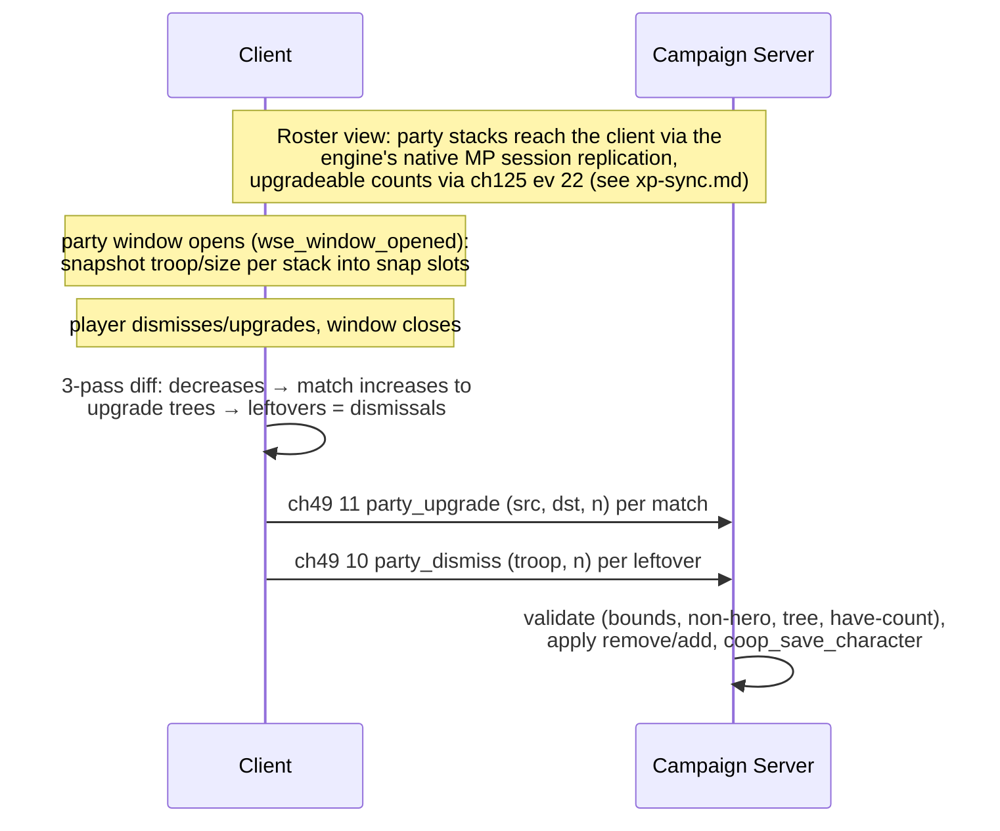

# Flow: Party Screen Sync (roster, dismiss, upgrade)

**Status:** AUDITED
**Validated against commit:** `ce0e287` (steamid persistence,
runtime-verified 2026-08-23: char-dict naming is sid-keyed for
Steam-identified players — persistence reference only, the roster sync
protocol is unaffected. Prior stamp `9558722`: A4 residual — server-side
upgrade-credit consumption — fixed in the B2B3 merge, runtime smoke
2026-07-25; prior stamp `a68b8ae`)

## Scope

How player-party roster edits made in the native party screen (dismissals
and upgrades) reach the authoritative campaign-server party, and how the
client's view of its roster is populated. Entry points: native party window
open/close. Exit state: server party mutated, char dict saved. Recruitment
(ch49 ev 23 / ch125 ev 33–34) is center-flow territory; the battle-server
temp-party sorting is battle machinery — both only referenced here.

Module paths relative to `wse2work/Native-Coop-master/`.

## Sequence diagram

## Code anchors

| # | Step | File | Line | Symbol |
|---|------|------|------|--------|
| 1 | Party snapshot at window open | `module_scripts.py` | 51190–51230 | `wse_window_opened` (window_party arm), `$g_coop_party_screen_open` |
| 2 | Close-diff pass 1: decrease deltas | `module_simple_triggers.py` | 4448–4466 | snap slots `slot_coop_party_snap_begin` + stride |
| 3 | Close-diff pass 2: upgrades matched via `troop_get_upgrade_troop` | `module_simple_triggers.py` | 4469–4513 | sends ch49 ev 11 |
| 4 | Close-diff pass 3: leftover decreases -> dismissals | `module_simple_triggers.py` | 4515–4525 | sends ch49 ev 10 |
| 5 | Server dismiss arm (validated) | `module_coop_scripts.py` | 8715–8729 | bounds 1–100, non-hero, have-count, save |
| 6 | Server upgrade arm (validated) | `module_coop_scripts.py` | 8730–8757 | upgrade-tree check, bounds, have-count, save |
| 7 | Upgradeable counts push | `module_coop_scripts.py` | 9678–9693 | `coop_send_party_upgradeable_to_client` (ch125 ev 22, see `xp-sync.md`) |
| 8 | Char dict party codec (troop, size, wounded) | `module_coop_scripts.py` | 7210–7230 | in `coop_save_character` (`:7217` wounded) |
| 9 | Battle-server temp-party sort (round transitions only) | `module_coop_scripts.py` | 3987–4020 | `coop_sort_party` (callers `module_coop_mission_templates.py:5214,5219`) |

## State & events

- **Events:** ch49: `party_sync_begin`=8, `party_sync_stack`=9 (**both dead —
  no senders, no handlers**, see audit row 4), `party_dismiss`=10,
  `party_upgrade`=11; ch125: `party_stack_num_upgradeable`=22 (upgradeable
  counts; renamed from `party_stack_xp` in the C5 fix) (`header_common.py`).
- **Client globals/slots:** `$g_coop_party_screen_open` (0/1/2 lifecycle),
  party snapshot at `slot_coop_party_snap_begin` + 3-slot stride
  (troop, size, decrease-delta) on `trp_temp_troop`.
- **Roster source:** client party stacks are populated by the engine's
  native MP session replication — not by any ch49/ch125 event. (Earlier
  revisions credited the C-layer `PKT_SNAPSHOT`/`PKT_DELTA` stream; that
  channel never functioned in the dedicated topology and was retired in
  B8, `a68b8ae`.)
- **Persistence:** stacks with wounded counts in the per-player char dict
  (`coop_char_sid_<acctid>` / `coop_char_<name>`, key-builder-owned naming
  since `ce0e287`).

## Invariants

- The party diff never trusts raw increases: an increase is only sent if it
  matches a snapshot decrease through `troop_get_upgrade_troop` — anything
  else is silently dropped client-side (`module_simple_triggers.py:4469–4513`).
- Server arms re-validate independently (bounds 1–100, non-hero, upgrade
  tree, have-count) — client and server checks are intentionally redundant
  (`module_coop_scripts.py:8715–8757`).
- Every accepted dismiss/upgrade ends in `coop_save_character` — roster
  changes are never memory-only.
- Wounded counts survive the char-dict round trip (`:7217`, `:7226`).

## Audit: ours vs. native

| # | Behavior | Ours (anchor) | Native ground truth (evidence) | Verdict |
|---|----------|---------------|--------------------------------|---------|
| 1 | Upgrade structure: tree-validated (both branches), count-bounded, non-hero, have-count-checked on the server | `module_coop_scripts.py:8730–8757` | Same legality rules the native party screen enforces (`troop_get_upgrade_troop` is the same source of truth) | OK |
| 2 | Upgrade **cost**: server charges the native gold cost (`game_get_upgrade_cost` × count) before applying and rejects unaffordable requests, so the server gold push no longer refunds the client's local charge. Fixed in `50f4ac1`, runtime-verified 2026-07-10. Residual fixed in the A4 fold-in (`bdcfd8c`, merged `9558722`, runtime smoke 2026-07-25): the ev-11 arm now consumes the from-stack's `num_upgradeable` credits server-side via op 3906 and re-pushes ev 22 — engine RE proved stacks have no XP field, credits are the only currency | `module_coop_scripts.py:8865–8875` (@ `fc1f204`); ev-11 arm (@ `bdcfd8c`) | Native upgrades consume stack upgrade XP and charge gold in the engine party screen. Coop now matches on both. | OK |
| 3 | Dismiss: non-hero, bounded, have-count-checked; no other consequences | `:8715–8729` | Native party-screen dismissal likewise has no gold/morale consequence for regulars; heroes can't be dismissed this way in native either | OK |
| 4 | ch49 ev 8/9 `party_sync_begin`/`party_sync_stack` constants deleted (`1dc8fec`) — they had no sender and no handler; project-state row corrected (IDs 8-9 marked free). Smoke passed 2026-07-11 | `header_common.py` (ID 8-9 free note) | Roster syncs via the engine's native MP replication (the C-layer snapshot/delta stream was retired in B8) | OK |
| 5 | Roster injection: client cannot add stacks via the diff (drop rule, invariant 1); raw ev-11 forgeries are limited to legal upgrade edges by server validation | `module_simple_triggers.py:4469–4513`; `module_coop_scripts.py:8730–8757` | Matches the server-authoritative design intent — except the free-cost hole in row 2 | OK |
| 6 | Party size limit: server enforces no cap on upgrades/dismissals (they don't grow the party); recruit paths own the cap question | n/a for this flow | Native party size limit is leadership/renown-driven and enforced at recruitment time — out of this flow's scope, owned by the recruit/center flow | OK |
| 7 | `coop_sort_party` orders battle-server temp parties only (spawn priority at siege round transitions) | `module_coop_scripts.py:3987–4020`; callers `module_coop_mission_templates.py:5214,5219` | Cosmetic/battle-internal; native party ordering rules don't apply to temp parties | OK |

## Fix list

| # | From audit row | What diverges | Suggested owner/layer |
|---|----------------|---------------|------------------------|
| 1 | 2 | ~~Upgrades are free~~ **Done**: gold cost fixed (`50f4ac1`, runtime-verified 2026-07-10); server-side upgrade-credit consumption fixed in the A4 fold-in (`bdcfd8c`, merged `9558722`, runtime smoke 2026-07-25 — reopening the party screen reflects consumed credits via the ev-22 re-push). | `module_coop_scripts.py` ev-11 arm |
| 2 | 4 | ~~Dead ev 8/9~~ **Done** (`1dc8fec`, smoke 2026-07-11): constants removed, project-state table corrected. | `header_common.py` + workbench project-state doc |

## Open questions

- Whether native upgrades preserve wounded status on upgraded units (coop's
  remove+add yields healthy upgrades). Parked: minor gameplay nuance,
  cheapest to answer in the wave-2 runtime smoke test rather than engine RE.

- **Not fixed (2026-09-10): the native party window's "Company: X/Y" header
  shows a wrong, frozen capacity denominator that doesn't track the real
  server-authoritative value.** Found while debugging a garrison-withdraw
  report ("Withdraw 5" only added 2) -- turned out withdraw was working
  correctly: `party_get_free_companions_capacity(player_get_party_id(...))`
  server-side (the same op+party-resolution `coop_hire_tavern` already uses
  successfully) correctly computed a real cap of 34 from the character's
  actual `leadership=1`/`renown=45` (34 used + 2 free), and the withdraw
  correctly added exactly the 2 that fit. But the party window showed
  "32/43" beforehand and "34/43" after a fresh reopen -- the numerator
  (roster count) tracked the real change exactly, the denominator (43)
  stayed frozen across both real, different game states, `9` off from the
  true `36` both times. Ruled out a merely-stale window-open snapshot: a
  full close+reopen refreshed the numerator but not the denominator.
  `window_party` is not built from module-script text at all (`module_scripts.py`
  `wse_window_opened`'s `window_party` case only hooks open/close for the
  roster diff-and-send sync, never touches the header) -- this is a
  purely native-rendered number, so there is no confirmed module-script
  lever to correct it, the same class of dead end as the mount-speed issue
  in `inventory-sync.md` row 14. Not investigated further without new
  evidence (no WSE2 engine source in this checkout to confirm what the
  native calculation actually reads). Functionally cosmetic only --
  garrison withdraw/deposit both correctly enforce the *real* capacity
  regardless of what this header displays.

## Related: tavern mercenary hire "no room" feedback (fixed 2026-09-07)

Not the roster-dismiss/upgrade flow this dossier otherwise covers, but the
same "checks the wrong party" bug class, found via a user report that
recruiting from a tavern silently did nothing when their party was full —
`coop_hire_tavern` (`module_coop_repairs.py`, already correctly
server-validates `party_get_free_companions_capacity` before accepting a
hire) was rejecting it correctly, but the client never told the player why.

Root cause: native's own mercenary-hire dialog (`module_dialogs.py`
~21405-21507, "Tavern Talk (with troops)") already has the exact feedback
line for this ("I can't lead any more men right now.") — but its
capacity check reads `party_get_free_companions_capacity(..., "p_main_party")`,
the native singleplayer singleton, which has no relationship to a coop
player's actual party. So the dialog's own client-side clamp (`$temp`,
computed from mercenary count / free capacity / affordable count) was
computed against the wrong party's capacity, meaning a full coop party
often still showed `$temp > 0` and let the hire option appear, silently
failing when the server correctly rejected it, without ever routing to the
"can't lead any more men" line.

Fixed: all three `party_get_free_companions_capacity` call sites in that
dialog chain now resolve the coop player's own real party
(`player_get_party_id(multiplayer_get_my_player())`) instead of
`p_main_party`, gated the same `game_in_multiplayer_mode` /
`$g_coop_in_local_visit` way as the existing `coop_queue_tavern_hire`
redirect a few nodes later in the same chain — native singleplayer is
unaffected. The gold-affordability clamp in the same node
(`store_troop_gold ... "trp_player"`) was deliberately left untouched —
out of scope for this specific report, not confirmed broken. **Not yet
playtest-confirmed.**

## Related docs

- `xp-sync.md` — ev 22 upgradeable push and snapshot-slot machinery.

Workbench documents (not part of the public export — see the citation
note in `README.md`):

- `docs/archive/RE_NATIVE_SCREENS.md`, `docs/archive/Screen_Session.md` — native window
  hooks behind `wse_window_opened`.
- project-state notes — C/DLL layer architecture (IPC-only since B8).
