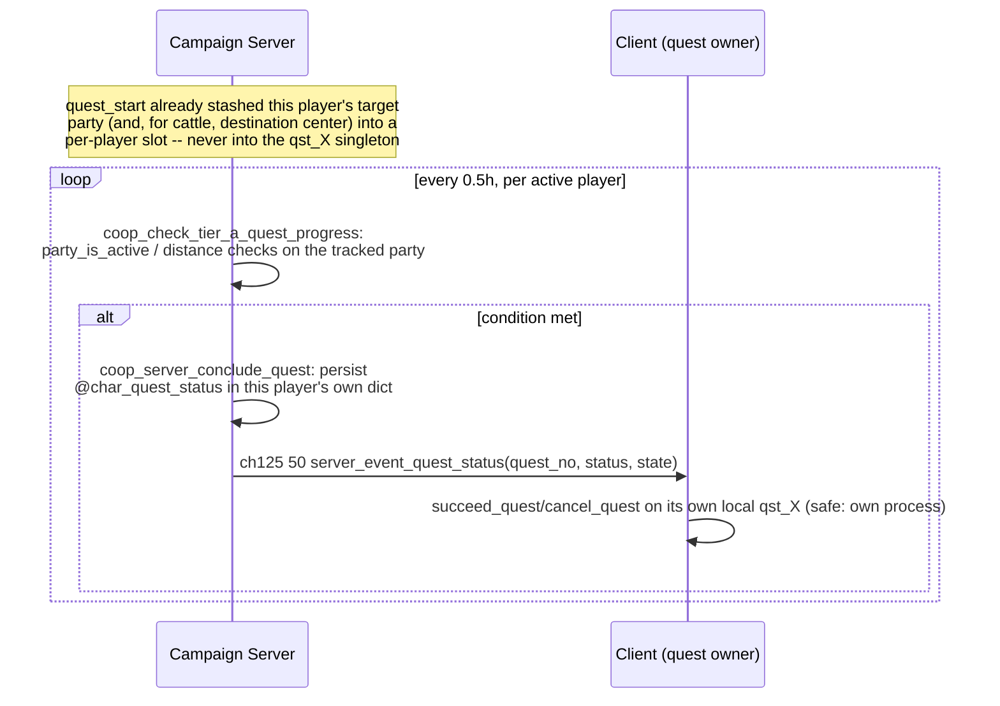

# Flow: Quests (Tier A completion + offer filtering)

**Status:** AUDITED (Tier A only — see Scope)
**Validated against:** build + `check_network_arity.py` + `check_campaign_protocol.py`
all clean, 2026-09-06. **Not yet runtime-verified** (no gameplay test
harness for this mod — see Open questions).

## Scope

Native Warband has ~60 quest types, almost all built around a `qst_X`
"quest object" that is a true engine-level **singleton** — one struct per
type, not an array — plus scene/map triggers in `module_triggers.py` /
`module_simple_triggers.py` that decide success/failure. This mod already
has a real, working **generic lifecycle-sync layer** reaching all 60 types
(accept / progress / status, per-player, via the char dict — see "Existing
generic layer" below). What was missing before this dossier: *completion
detection*. Nearly every native success/fail trigger is gated
`(neg|game_in_multiplayer_mode)`, so a connected player could accept a
quest, even have its target correctly spawned and synced, but the quest
could never be marked succeeded or failed.

This pass ("Tier A") fixes exactly 3 quest types whose completion signal is
a pure server-computable map check, confirms 5 more already work with zero
new code (dialog-only completion, no trigger dependency), and **blocks**
every other native quest type from ever being offered to a connected
player rather than leaving it silently unfinishable.

**Explicitly out of scope** (deferred to future passes, not started):
- **Tier B**: ~10-15 army/marshal/kingdom-council quest types
  (`qst_report_to_army`, `qst_organize_feast`, `qst_rebel_against_kingdom`,
  etc.) entangled in the same `$players_kingdom`/faction-marshal singleton
  `docs/flows/vassalage.md` already had to redesign for faction membership.
  Needs comparable per-player rework before any of these can be turned on
  safely.
- **Tier C**: dueling/romance/rare types with no coop-relevant hook at all.
- Also blocked this pass despite looking Tier-A-adjacent at first glance:
  `qst_deliver_cattle` (its native progress script
  `script_remove_cattles_if_herd_is_close_to_party` wasn't verified free of
  `p_main_party` coupling), `qst_collect_taxes` (drives `jump_to_menu`
  transitions and an in-menu "resting" mechanic, not a pure counter —
  bespoke shape, not a drop-in copy of the pattern below),
  `qst_kill_local_merchant` (force-teleports the player via
  `$auto_enter_town`/`$quest_auto_menu` — a different mechanic entirely).

Module paths relative to `wse2work/Native-Coop-master/`.

## Existing generic layer (unchanged by this pass)

Already built before this session, confirmed working by direct code
reading: ch49 `quest_start`=29 / `quest_data`=30 / `quest_status`=32 /
`quest_aux`=33 (client→server) and ch125 `server_event_quest_start`=47 /
`_target`=49 / `_status`=50 / `_aux`=51 (server→client), dispatched in
`module_coop_scripts.py`'s `multiplayer_campaign_client_events` /
`multiplayer_campaign_server_events`. Every quest's active/status/target
data is persisted per-player in that player's own char dict
(`@char_quest_{quest_no}`, `@char_quest_status_{quest_no}`,
`@char_quest_target_{quest_no}`, etc. — no cross-player collision, unlike
the live singleton). Generic wrappers `script_start_quest`/
`script_succeed_quest`/`script_fail_quest`/`script_end_quest`
(`module_scripts.py`) already funnel every one of the 60 quest types
through this sync layer via `script_coop_queue_quest_status`
(`module_coop_repairs.py`) — this is why the sync plumbing reaches all 60
types despite zero dialog-level edits anywhere.

## Why the server can't just call `script_succeed_quest`

A native `qst_X` object is one struct per **process**. Each client is its
own OS process, so a client mutating its own local `qst_troublesome_bandits`
copy is safe — but the dedicated server is *also* one particular process,
and it never used the live singleton as its source of truth even before
this pass: real per-instance state (spawned parties, dict-persisted
target/status) was already the actual source of truth. `script_succeed_quest`/
`script_fail_quest` are designed to be called by whichever process already
owns the authoritative local `qst_X` copy (a client concluding its own
quest) — calling them from the server for an arbitrary player doesn't
target the right client and mutates a singleton the server doesn't actually
use for anything. New server-detected completions must instead update the
winning player's own dict directly and explicitly push the result to that
one client — see `coop_server_conclude_quest` below.

## Sequence diagram (server-detected completion path)

## Code anchors

| # | Step | File | Symbol |
|---|------|------|--------|
| 1 | Per-player tracking slots (party/center being watched) | `module_constants.py` | `slot_player_coop_quest_party_troublesome_bandits` (75), `_cattle_herd` (76), `slot_player_coop_quest_center_cattle_herd` (77), `_escort_caravan` (78) |
| 2 | Slots populated at quest acceptance | `module_coop_scripts.py` | `quest_start` arm of `multiplayer_campaign_client_events`, the existing per-type spawn branches |
| 3 | Server-authoritative conclusion + client push | `module_coop_scripts.py` | `coop_server_conclude_quest` |
| 4 | Periodic completion/failure detection | `module_coop_scripts.py` | `coop_check_tier_a_quest_progress` |
| 5 | Periodic trigger (0.5h cadence) | `module_simple_triggers.py` | new entry beside the marshal-vacancy/diplomatic-indices triggers |
| 6 | Offer filter (blocks Tier B/C from being offered) | `module_coop_scripts.py` | `coop_quest_type_allowed` |
| 7 | Filter wired into native quest selection (2 call sites) | `module_scripts.py` `script_get_quest` | after the `script_get_dynamic_quest` call (~18003), and inside the `try_for_range :unused 0 20` retry loop (~18094-18100) |

## State & events

- No new network event: reuses `multiplayer_event_multiplayer_campaign_server_event_quest_status`
  (ch125 ev 50), the same one `script_succeed_quest`/`script_fail_quest`
  already use when a client concludes its own quest — the client-side
  receive arm needed zero changes.
- Status codes are the existing constants: `coop_quest_status_succeeded=4`,
  `1`=failed (`module_constants.py`).
- Tracking slots hold a live party id (or, for the cattle destination, a
  center id), or `0` meaning "not currently tracked." Always re-set fresh
  on every `quest_start` for that type, so a player completing and later
  re-accepting the same quest type just overwrites the old value — no
  explicit reset needed between instances.

## Invariants

- **Never read the native `qst_X` singleton server-side.** All new
  server-side logic reads only per-player slots/dict fields set at
  `quest_start` time. This is the load-bearing invariant that makes
  concurrent players each running the same quest type safe.
- `coop_server_conclude_quest` re-checks `@char_quest_status_{quest_no}` is
  still `0` (active) before writing — a stale/duplicate periodic-check hit
  can't resurrect or overwrite an already-concluded quest (same guard shape
  as the existing client-reported `quest_status` arm).
- `qst_troublesome_bandits` success is a deliberate simplification vs.
  native: native distinguishes "player killed it" (succeed) from "someone
  else killed it" (abort) via template-wide destroy-count comparisons; this
  pass succeeds on **any** removal of that quest's specific spawned party,
  regardless of who removed it. Documented trade-off, not a bug.
- `qst_escort_merchant_caravan`'s success path is untouched native dialog
  logic (already coop-safe, no MP gate found) — this pass only adds the
  fail detection (caravan destroyed) that was previously native-gated.
- The offer filter (`coop_quest_type_allowed`) returns `1` unconditionally
  in single-player (`neg|game_in_multiplayer_mode`) — zero behavior change
  for native SP. In multiplayer it allow-lists exactly the 8 Tier-A types;
  everything else is treated as just another failed precondition by
  `script_get_quest`'s own existing 20-attempt retry loop — no dialog files
  were touched to achieve this.

## Open questions

- **No playtest performed.** Build/arity/protocol checks are clean but this
  mod has no gameplay test harness. Suggested manual tests: accept each of
  `qst_troublesome_bandits`/`qst_escort_merchant_caravan`/`qst_move_cattle_herd`
  as a connected client and resolve them (kill the target / lose the
  caravan / deliver or lose the herd), confirming the quest actually
  transitions and the reward dialog unlocks; confirm a blocked type (e.g.
  `qst_collect_taxes`) is never offered while connected but unaffected in
  single-player.
- The 5 "already fine" types (`qst_deliver_grain`, `qst_deliver_wine`,
  `qst_deal_with_looters`, `qst_kidnapped_girl`,
  `qst_train_peasants_against_bandits`) are allowed based on static
  analysis (no multiplayer gate found on their completion path), not a live
  playtest. If one turns out to be broken in practice (e.g. a native op
  like `store_num_parties_destroyed_by_player` behaving oddly for a
  non-host client), remove it from `coop_quest_type_allowed`'s allow-list
  immediately — that alone fully blocks it again, no other change needed.
- A second, separate call site of `script_get_dynamic_quest`
  (`module_scripts.py` ~19704 as of the research pass) was not covered by
  the offer filter — it looked like an eligibility pre-check rather than
  the path that actually assigns the offered quest, but this wasn't fully
  traced. If a blocked quest type is ever observed being offered anyway,
  check this call site first.
- No "step down"/expiration handling was added for the 3 newly-detected
  quest types beyond what the existing generic layer already provides;
  native's own day-countdown expiration trigger remains
  `(neg|game_in_multiplayer_mode)`-gated and out of scope for this pass.
