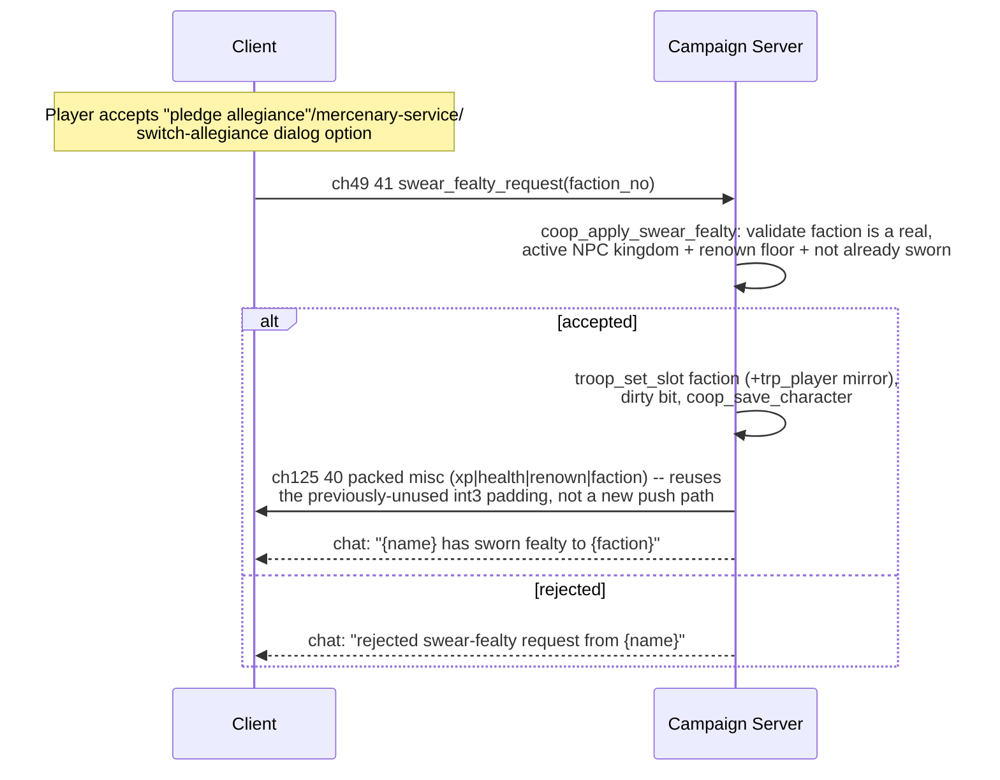
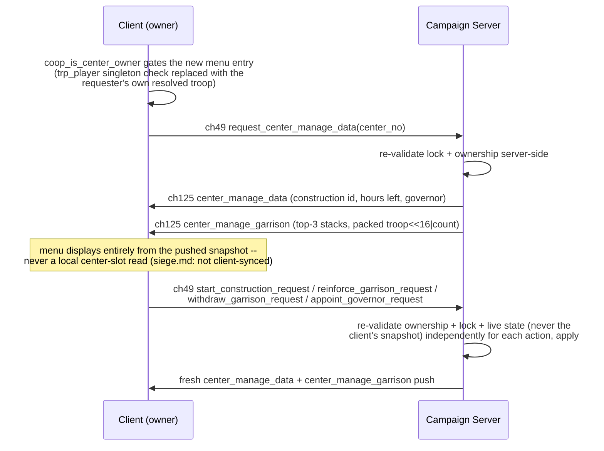

# Flow: Vassalage (faction membership, fiefs, marshal, war)

**Status:** AUDITED (Phases 1-4, scope as documented per phase below)
**Validated against:** build + `check_network_arity.py` + `check_campaign_protocol.py`
all clean, 2026-09-06 (Phase 1), 2026-09-06 (Phases 2-4, same session).
**Not yet runtime-verified** (no gameplay test harness for this mod -- see
Open questions).

## Scope

Lets a connected co-op player swear fealty to an NPC kingdom via the
existing native lord dialog, independently of every other connected
player (Phase 1); receive personal ownership of centers their faction
captures (Phase 2); be auto-appointed marshal of their kingdom by renown
(Phase 3); and ask their liege to declare war (Phase 4). Each phase's exact
scope cuts are documented in its own section below -- this is not full
native parity (see each phase's "not included" notes).

Module paths relative to `wse2work/Native-Coop-master/`.

## Why per-player state, not native's faction singleton

Native Warband's vassalage is a singleton: `$players_kingdom` and
`fac_player_supporters_faction` assume exactly one human player. This mod
has N independently connected player troops
(`multiplayer_campaign_player_troops_begin + player_no`), so two players
could not otherwise belong to two different kingdoms. This flow tracks
membership entirely per-player instead: a troop slot
(`slot_troop_coop_faction`) mirrored to `trp_player` (native
report/dialog conditions read `trp_player`), persisted in each player's own
`$coop_char_dict` as `@char_faction`. This mirrors the mod's existing
precedent for the same singleton-collision problem: personal relation
deltas and siege hostility are already tracked per-player rather than on
the shared native faction/relation tables (`module_coop_scripts.py`
comments near `coop_save_character`/siege-hostility code).

## Phase 1: Faction membership ("swear fealty")

Explicitly out of scope for Phase 1 alone (delivered in later phases or
still not implemented): any of native's other `player_join_faction` side
effects (auto-transferring owned centers, aborting faction-hostile quests,
prisoner release/capture).

### Sequence diagram



### Code anchors

| # | Step | File | Symbol |
|---|------|------|--------|
| 1 | Per-player faction slot + renown-gate constant | `module_constants.py` | `slot_troop_coop_faction`, `coop_vassal_min_renown` |
| 2 | Dirty-bit constant | `module_constants.py` | `coop_char_dirty_faction` |
| 3 | New client->server event | `header_common.py` | `multiplayer_event_multiplayer_campaign_swear_fealty_request` (ch49 ev 41) |
| 4 | Dialog consequence redirect (3 sites: pledge-allegiance, switch-allegiance, mercenary-service) | `module_dialogs.py` | wraps each native `script_player_join_faction` call in a `game_in_multiplayer_mode` / `$g_coop_in_local_visit` gate |
| 5 | Client-side send | `module_coop_repairs.py` | `coop_queue_swear_fealty` |
| 6 | Server dispatch arm | `module_coop_scripts.py` `multiplayer_campaign_client_events` | `eq :event_type multiplayer_event_multiplayer_campaign_swear_fealty_request` |
| 7 | Server validate + apply | `module_coop_scripts.py` | `coop_apply_swear_fealty` |
| 8 | Sync push (extends the existing misc packed message, ev 40 -- does not add a new push path) | `module_coop_scripts.py` | `coop_char_pack_send_misc` (send), `coop_char_client_receive` misc arm (recv) |
| 9 | Save/load | `module_coop_scripts.py` | `coop_save_character` / `coop_load_character` -- `@char_faction`, has_key-guarded on load |

### State & events

- **Event:** ch49 `swear_fealty_request` = 41, payload = faction id only
  (the server independently validates it; a lord/target-troop id is not
  needed since the check is purely "is this a real active kingdom").
- **Dirty bit:** `coop_char_dirty_faction` (256), same
  `slot_player_coop_char_dirty` bitmask as attrs/skills/renown/etc.
- **Sync payload reuse:** `coop_char_pack_send_misc` (ch125 ev 40) previously
  sent `int3` as a hardcoded `0` (unused padding). This flow repurposes that
  slot to carry the faction id unpacked (no bit-packing needed, it's a
  whole free int) rather than opening a fifth sync path -- consistent with
  the "four owner scripts, nothing else" contract documented at
  `module_coop_scripts.py` above `coop_char_client_diff_and_send`.
- **Value:** faction id, or `-1` for no membership. `-1` is the default for
  a fresh character (no save file) and for any load of a pre-Phase-1 char
  dict lacking `@char_faction`.

### Invariants

- Faction membership is never trusted from the client: `coop_apply_swear_fealty`
  independently re-checks the target is a real, `sfs_active` NPC kingdom
  (`npc_kingdoms_begin`..`npc_kingdoms_end`, excluding `fac_player_faction`,
  `fac_commoners`, `fac_outlaws`, and the shared
  `fac_player_supporters_faction`) and that the player's own renown meets
  `coop_vassal_min_renown`, regardless of what the client's dialog gate
  showed.
- A player troop reused across joins (server memory is shared across
  connections) must not leak a prior occupant's faction: `coop_load_character`
  explicitly resets the slot to `-1` on the no-save-file path, same
  reasoning as the existing gold/attribute "replace exactly" resets.
- Native's other `player_join_faction` side effects (fief transfer, quest
  abort, prisoner release) are deliberately NOT invoked -- only the
  dialog's literal `script_player_join_faction` call is redirected; every
  other line at each of the three dialog nodes is untouched native
  behavior.

## Phase 2: Fiefs

When a co-op siege capture resolves, a captor who is a sworn vassal gets
the center personally (their kingdom + `slot_town_lord` = their troop)
instead of the fixed `fac_player_faction`. An unsworn captor (no NPC
vassalage, no player-founded kingdom) is auto-founded a personal kingdom
from the same 4-slot pool as an explicit "Found your own Kingdom" click,
named "Kingdom of {their name}" (added 2026-09-09 -- `fac_player_faction`
is native's shared placeholder faction, a singleton, so it can't be
personalized per-captor without incorrectly renaming it for every other
unsworn captor's own castles too; see Phase 5 below for the pool). If the
pool of 4 is already exhausted, the center falls back to the original
`fac_player_faction` grant, same as before this existed.

Deliberately does **not** call native `script_give_center_to_lord`: that
script resolves the new owner's faction via `store_troop_faction(lord_troop_id)`
for any troop that isn't literally `trp_player`/`-1` -- our vassal's real
native faction attribute is never touched by Phase 1 (only our own custom
slot is), so it would resolve to the troop's default native faction, not
the sworn kingdom. Mutating a live player troop's actual native faction
attribute to fix that was judged too risky (unreviewable blast radius
across native code that queries party/troop faction for loot, siege
hostility, quest gating). Instead: call the fully generic
`script_give_center_to_faction` (confirmed no `trp_player` coupling in its
`_aux`) for the faction transfer, then set `slot_town_lord` explicitly
ourselves for personal ownership.

### Code anchors

| # | Step | File | Symbol |
|---|------|------|--------|
| 1 | Replaces the single hardcoded `fac_player_faction` grant | `module_coop_scripts.py` | `coop_siege_capture_consequences` |
| 2 | Resolve captor's faction, grant + broadcast + chat | `module_coop_scripts.py` | `coop_grant_fief_to_captor` |
| 3 | Auto-found a kingdom for an unsworn captor (2026-09-09), reusing the Phase 5 pool | `module_coop_scripts.py` | `coop_ensure_player_kingdom_for_troop` |

### Invariants

- Broadcasts the new `slot_town_lord` to **every** connected player (not
  just the captor) via the mod's own existing replication event
  (`multiplayer_event_multiplayer_campaign_server_event_center_owner`,
  reused from its original join-sync send site -- no new network event).
- Falls through to today's unchanged `fac_player_faction` grant if the
  captor has no faction, an inactive faction, or isn't a resolvable player
  (e.g. `-1`/local-siege edge cases already handled by the existing
  `captor_player_no` resolution at both call sites), OR if
  `coop_ensure_player_kingdom_for_troop` can't find a free pool slot.
- `coop_ensure_player_kingdom_for_troop` deliberately duplicates (does not
  refactor into) `coop_apply_found_kingdom`'s own pool-slot logic -- same
  reasoning as `coop_ev_cli_reinforce_garrison`'s duplicate-not-refactor
  choice elsewhere in Phase 6: smaller regression surface than touching an
  already-working, directly-player-triggered action. It also deliberately
  does **not** touch `trp_player` (unlike every explicit player action in
  this file) -- it fires as a background side effect of a capture
  resolving, not this player's own live client request, so there's no
  guarantee `trp_player` currently represents this captor; the
  server-authoritative `slot_troop_coop_faction` write plus the char-sync
  push are enough to reach their client correctly.

## Phase 3: Marshal (auto-appoint by renown)

No interactive vote (deliberate simplification -- see project decision
log). A daily server-side check (`module_simple_triggers.py`, same
`this_or_next|multiplayer_is_server` gating as the war/peace trigger it
sits beside) appoints the highest-renown *connected, sworn* vassal of a
faction as its marshal whenever the post is vacant. Uses the existing,
already-symmetric native helper `script_appoint_faction_marshall`
(`module_scripts.py`, sets `slot_faction_marshall` + toggles
`party_set_marshall` old/new).

**Not included** (separate future scope, comparable in size to this whole
phase again): re-enabling the summon-to-army quest flow
(`qst_report_to_army`/`qst_follow_army` are singleton quest slots with no
per-player dimension; native's `p_main_party`-keyed triggers are still
fully disabled in multiplayer and untouched by this phase). This phase
only covers *who holds the marshal title*.

### Code anchors

| # | Step | File | Symbol |
|---|------|------|--------|
| 1 | Daily trigger | `module_simple_triggers.py` | new `(24, [...])` entry beside the diplomatic-indices trigger, calling `script_coop_check_marshal_vacancies` |
| 2 | Vacancy scan + appoint | `module_coop_scripts.py` | `coop_check_marshal_vacancies` |

### Invariants

- Only fills a **vacant** post (`slot_faction_marshall <= 0`). An
  already-appointed marshal is never replaced by this check, even if their
  player has since disconnected -- there is no "step down" mechanic, and
  checking the marshal's party-active state as a vacancy signal would be
  unreliable for player troops (`slot_troop_leaded_party` is never set for
  them) and would cause repeated reassignment/chat spam every trigger tick.
- `script_appoint_faction_marshall`'s `party_set_marshall` "on" half is a
  no-op for our vassal appointees today (their troop's
  `slot_troop_leaded_party` isn't populated), since this phase doesn't
  implement army-summon. `slot_faction_marshall` itself is still set
  correctly, so the title/status is real even though the engine-level
  army-following flag isn't exercised yet.

## Phase 4: War declarations (dialog-only declare; peace needs no new code)

A vassal can ask their own liege to declare war via the existing native
dialog, redirected the same way as Phase 1's swear-fealty (their own sworn
faction, resolved server-side, never trusted from the client).

**Peace does not need a coop-side mechanic.** The original plan assumed
`script_randomly_start_war_peace_new`'s player-singleton peace-offer branch
(`cur_kingdom_2 == fac_player_supporters_faction`, paging an unreachable
singleton notification menu) would strand vassal-involved wars. On review
this doesn't apply: our vassals only ever hold real
`npc_kingdoms_begin..npc_kingdoms_end` factions, never the native
`fac_player_supporters_faction` singleton (Phase 1's validation explicitly
excludes it), so every vassal-involved war already goes through that same
script's ordinary **NPC-vs-NPC** peace path
(`module_scripts.py` ~25896-25911, no menu involved) completely unmodified.
No new code was needed or written for peace.

### Code anchors

| # | Step | File | Symbol |
|---|------|------|--------|
| 1 | New client->server event | `header_common.py` | `multiplayer_event_multiplayer_campaign_declare_war_request` (ch49 ev 42) |
| 2 | Dialog consequence redirect | `module_dialogs.py` | `minister_declare_war_confirm_yes` node |
| 3 | Client-side send | `module_coop_repairs.py` | `coop_queue_declare_war` |
| 4 | Server dispatch arm | `module_coop_scripts.py` `multiplayer_campaign_client_events` | `eq :event_type multiplayer_event_multiplayer_campaign_declare_war_request` |
| 5 | Server validate + apply | `module_coop_scripts.py` | `coop_declare_war_for_vassal` |

### Invariants

- Requester's own faction is always resolved server-side from
  `slot_troop_coop_faction`; only the *target* faction id is taken from the
  client, and is itself re-validated (real, active, distinct, not already
  at war via `script_diplomacy_faction_get_diplomatic_status_with_faction`).

## Phase 5: Player-founded factions ("kingdoms")

Lets a connected player found their own faction and other connected players
request to join it -- modeled directly on how native Warband itself lets a
player go independent: `script_activate_player_faction`/
`script_deactivate_player_faction` (`module_scripts.py:31999-32100+`) don't
create a faction at runtime (Warband has no such operation -- confirmed via
exhaustive `header_operations.py` grep), they activate, rename
(`faction_set_name`), recolor (`faction_set_color`) and reassign the leader
of one single, pre-declared, normally-inactive faction slot,
`fac_player_supporters_faction` (`module_factions.py:43`). Since this mod is
intended for a max of 4 connected players, this phase pre-declares a
**fixed pool of 4** such slots instead of one singleton:
`player_faction_1..4` (`module_factions.py`, after the `kingdoms_end`
sentinel -- deliberately outside `npc_kingdoms_begin..npc_kingdoms_end` so
Phase 1's NPC-only swear-fealty never matches them), each starting
`sfs_inactive` with `slot_faction_coop_owner_troop = -1` (init beside the
native `fac_player_supporters_faction` reset, `module_scripts.py:41`).

Two distinct actions:

- **Founding** and **leaving/disbanding** are single-player actions (no one
  else involved) and apply immediately, the same as Phase 1 swear-fealty.
- **Joining another player's kingdom** has a human on the other end, so
  unlike swearing to an inert NPC kingdom it needs their consent -- a
  request/accept/reject handshake instead of an immediate apply.

There is no player-vs-player dialogue in this mod, so all five actions are
driven from the existing co-op debug menu (`mnu_coop_debug_cheats`,
`module_game_menus.py`), the same place Phase-1-adjacent debug cheats
already live.

### Sequence diagram

```mermaid
sequenceDiagram
    participant A as Player A (founder)
    participant B as Player B
    participant CS as Campaign Server

    A->>CS: ch49 43 found_kingdom_request
    CS->>CS: coop_apply_found_kingdom: claim first idle<br/>player_faction_N slot, rename/recolor/activate
    B->>CS: ch49 45 join_faction_request(target_player_no=A)
    CS->>CS: resolve A's current faction, stash on<br/>B's own pending-invite slot
    CS-->>B: chat: "A wants to join your kingdom..."
    Note over B: B is actually the ACCEPTOR here only if A<br/>requested to join B; in this example B requests<br/>to join A, so A holds the pending invite instead
    A->>CS: ch49 46 join_faction_accept
    CS->>CS: coop_apply_join_faction_accept: re-resolve<br/>acceptor's faction fresh, apply to requester
    CS-->>A: chat: "B accepted into {faction}"
```

### Code anchors

| # | Step | File | Symbol |
|---|------|------|--------|
| 1 | Faction pool (4 slots + end sentinel) | `module_factions.py` | `player_faction_1..4`, `coop_player_kingdoms_end` |
| 2 | Range constants + owner slot | `module_constants.py` | `coop_player_kingdoms_begin`/`_end`, `slot_faction_coop_owner_troop`, `slot_player_coop_pending_join_from` |
| 3 | Pool init (idle at game start) | `module_scripts.py` | beside the `fac_player_supporters_faction` reset, `:41` |
| 4 | New ch49 events (43-47) | `header_common.py` | `found_kingdom_request`, `leave_faction_request`, `join_faction_request`, `join_faction_accept`, `join_faction_reject` |
| 5 | Client-side senders | `module_coop_repairs.py` | `coop_queue_found_kingdom`, `coop_queue_leave_faction`, `coop_queue_join_faction_request/accept/reject` |
| 6 | Debug-menu buttons | `module_game_menus.py` | `mnu_coop_debug_cheats`: found/leave/3x join-request (per other seat, condition-hidden via `player_is_active`)/accept/reject |
| 7 | Server dispatch arms | `module_coop_scripts.py` `multiplayer_campaign_client_events` | ev 43-47 arms, beside the ev-41/42 arms |
| 8 | Server validate + apply | `module_coop_scripts.py` | `coop_apply_found_kingdom`, `coop_apply_leave_faction`, `coop_apply_join_faction_request/accept/reject` |
| 9 | Interop extensions | `module_coop_scripts.py` | `coop_declare_war_for_vassal`, `coop_grant_fief_to_captor`, `coop_check_marshal_vacancies` -- each gets a second `is_between(coop_player_kingdoms_begin, coop_player_kingdoms_end)` branch alongside the existing NPC-kingdom check |

### State & events

- **Events:** ch49 `found_kingdom_request`=43 (no payload), `leave_faction_request`=44
  (no payload), `join_faction_request`=45 (payload: target `player_no`),
  `join_faction_accept`=46 (no payload), `join_faction_reject`=47 (no payload).
  Accept/reject carry no payload because the server already knows the
  pending request from the *target's own* `slot_player_coop_pending_join_from`
  -- never trusted from the client.
- **Faction slot:** `slot_faction_coop_owner_troop` -- the founder's troop
  id, or `-1` if the pool slot is idle.
- **Player slot:** `slot_player_coop_pending_join_from` -- requester
  `player_no` of a pending invite awaiting this player's accept/reject, or
  `-1`. Session-only, not dict-persisted (lost on disconnect is fine, the
  requester just re-asks).
- **Persistence:** membership itself reuses Phase 1's existing
  `slot_troop_coop_faction`/`@char_faction` and packed-misc sync push (ev
  40) unchanged -- a player-owned faction id is just another valid value
  for that same field, no new sync path needed.

### Invariants

- Founding never trusts anything from the client beyond "I want to found a
  kingdom": the server independently re-checks the player doesn't already
  own an active pool slot and picks the first idle one itself.
- Joining always needs the *target's* explicit accept -- a join-request
  only ever stashes a pending invite; `coop_apply_join_faction_accept`
  re-resolves the acceptor's own current faction fresh at accept time
  (not from whatever it was when the request first arrived), so a target
  who left/disbanded/switched between request and accept can't leak a
  stale faction id to the requester.
- `coop_apply_join_faction_accept` deliberately does **not** mirror
  `trp_player` for the requester (unlike every other faction-mutating
  script here, which mirrors it for the *acting* player) -- accept runs in
  the *acceptor's* request context, not the requester's own connection, so
  writing the requester's data into the server's singleton `trp_player`
  copy there would be the same class of cross-connection mirror hazard
  already fixed once this session for inventory sync (see
  `inventory-sync.md`'s mirror-clobber-race row). The requester's own
  client refreshes its own `trp_player` copy normally when it receives the
  packed misc sync push (`module_coop_scripts.py:~7693-7696`).
- Disbanding frees the pool slot (owner reset to `-1`, `sfs_inactive`) so a
  later founder can reclaim it; leaving as a mere member only clears the
  leaver's own membership, the faction itself is untouched.
- Phase 1's `coop_apply_swear_fealty` is **deliberately left untouched** --
  swearing to a player-owned faction always goes through this phase's
  request/accept flow instead, since a human must consent; the old
  NPC-only path stays NPC-only.

## Fixed: "Invalid Faction ID: -1" server error on unsworn siege captures (2026-09-07)

**Symptom:** server log showed `SCRIPT ERROR: Invalid Faction ID: -1` at
`coop_grant_fief_to_captor` (opcode 542 = `faction_slot_eq`) immediately
after an *unsworn* player captured a castle via siege -- the capture and
XP/gold/renown award still completed (this is a recoverable script error,
not a hard crash), but the error was real and needed fixing.

**Root cause:** a nested `try_begin`/`else_try`/`try_end` used inline as an
"A is in range1 OR range2" check does **not** short-circuit the *enclosing*
try_begin when neither branch's conditions hold -- it only terminates its
own (inner) block and execution falls through to whatever comes after the
inner `try_end`, in the *same outer scope*, regardless of whether either
branch actually succeeded. Concretely:

```python
(try_begin),                                    # outer chain
    ...
    (try_begin),                                # inner "OR"
        (is_between, ":captor_faction", npc_kingdoms_begin, npc_kingdoms_end),
    (else_try),
        (is_between, ":captor_faction", coop_player_kingdoms_begin, coop_player_kingdoms_end),
    (try_end),
    (faction_slot_eq, ":captor_faction", slot_faction_state, sfs_active),  # <- runs even if BOTH branches above failed
(try_end),
```

For an unsworn captor, `:captor_faction == -1`, both `is_between` checks
fail, the inner block ends, and `faction_slot_eq` ran anyway with `-1` --
hence the error. This exact pattern was introduced in this session's Phase
5 work at 3 call sites: `coop_declare_war_for_vassal` (both the requester
and target faction checks) and `coop_grant_fief_to_captor` -- all 3 fixed
the same way, by computing an explicit flag inside the inner try and gating
the outer chain on that flag instead of relying on inner-block fallthrough:

```python
(assign, ":captor_range_ok", 0),
(try_begin),
    (is_between, ":captor_faction", npc_kingdoms_begin, npc_kingdoms_end),
    (assign, ":captor_range_ok", 1),
(else_try),
    (is_between, ":captor_faction", coop_player_kingdoms_begin, coop_player_kingdoms_end),
    (assign, ":captor_range_ok", 1),
(try_end),
(eq, ":captor_range_ok", 1),                    # now genuinely gates the outer chain
(faction_slot_eq, ":captor_faction", slot_faction_state, sfs_active),
```

`coop_apply_found_kingdom` and `coop_apply_leave_faction` also nest
try_begin/else_try, but were NOT affected: each branch there is
self-contained (does its own complete work, including any `assign`s it
needs) and nothing shared *after* the inner `try_end` depends on which
branch fired, so there was nothing for the fallthrough to corrupt.
`coop_check_marshal_vacancies`'s Phase 5 extension uses two independent
top-level `try_for_range` loops rather than an inline nested OR, so it was
also unaffected.

**Lesson for future nested try_begin/else_try in this codebase:** never use
a nested try/else_try purely as an inline boolean OR feeding into a shared
line after its `try_end` in the same (outer) scope -- it will silently pass
through on total failure instead of aborting the outer chain. Only safe
nesting shapes are: (a) each branch is fully self-contained, or (b) the OR
result is captured in an explicit flag variable and re-tested as its own
condition line immediately after the inner `try_end`.

## Phase 6: Settlement management (garrison, tax, construction, governor)

Lets a settlement's owner (`slot_town_lord` -- any captor, sworn vassal or
not, matching Phase 2's own scope) manage what they own: reinforce/withdraw
the garrison, start native construction projects, get passive tax income,
and appoint a cosmetic governor. Two research passes this session found that
native's own management screens can't be reused safely: they're gated on
the `trp_player` singleton (same bug class as mount-icon/tavern-hire/Phase
1), and worse, the garrison-exchange screen specifically
(`change_screen_exchange_members`, `header_operations.py:1793`) opens an
engine window with **no known window id** anywhere in this codebase
(`wse_window_opened` only handles `window_inventory=7`/`window_party=8`/
`window_character=11`, `module_scripts.py:51474+`), so there is no way to
detect its close to diff/validate changes -- the same class of dead end as
the confirmed-unfixable campaign-map horse-speed issue, without engine
source this checkout doesn't have. This phase is therefore a **new, fully
parallel, server-authoritative menu** (`mnu_coop_manage_settlement` and its
submenus, `module_game_menus.py`) beside native's own screens, not a re-gate
of them. Scope is towns/castles only -- villages are never ownable via this
mod's siege/fief flow.

### Sequence diagram



### Code anchors

| # | Step | File | Symbol |
|---|------|------|--------|
| 1 | Coop-safe ownership check | `module_coop_scripts.py` | `coop_is_center_owner` |
| 2 | Snapshot push (construction/governor + top-3 garrison stacks) | `module_coop_scripts.py` | `coop_send_center_manage_data` |
| 3 | New ch49 events (200-204) + ch125 pushes (200-201) | `header_common.py` | `request_center_manage_data`, `start_construction_request`, `reinforce_garrison_request`, `withdraw_garrison_request`, `appoint_governor_request`, `server_event_center_manage_data`, `server_event_center_manage_garrison` |
| 4 | Construction start (reuses native `script_get_improvement_details` + its own cost/time formula against the owner's real party, not `p_main_party`) | `module_coop_scripts.py` | `coop_apply_start_construction` |
| 5 | Garrison reinforce (deliberately duplicates, not refactors, `coop_ev_cli_request_recruit`'s volunteer-pool branch -- destination party differs, arity of the already-working shared event is untouched) | `module_coop_scripts.py` | `coop_ev_cli_reinforce_garrison` |
| 6 | Garrison withdraw (re-reads live composition fresh at apply time, never trusts the pushed snapshot; capacity-checked like the tavern-hire fix) | `module_coop_scripts.py` | `coop_apply_withdraw_garrison` |
| 6b | Garrison deposit -- move a whole regular-troop stack from the owner's own party into the garrison (the reverse of withdraw; added 2026-09-09). Whole-stack only, no quantity picker -- a client->server message tops out at 3 payload ints (`multiplayer_send_3_int_to_server`) and `center_id` + `troop_id` already uses both, so this deliberately matches Withdraw's own no-quantity UX instead of bit-packing a count | `module_coop_scripts.py` | `coop_apply_deposit_garrison` |
| 7 | Governor appoint/clear (cosmetic only; membership re-validated server-side, `-1` clears) | `module_coop_scripts.py` | `coop_apply_appoint_governor` |
| 8 | Daily construction-completion + tax trigger (reuses native's own `slot_center_has_*` flip so unmodified native prosperity/trade scripts see it for free) | `module_simple_triggers.py` (interval 24) / `module_coop_scripts.py` | `coop_check_center_manage_daily` |
| 9 | Client-side senders | `module_coop_repairs.py` | `coop_queue_request_center_manage_data`, `coop_queue_start_construction`, `coop_queue_reinforce_garrison`, `coop_queue_withdraw_garrison`, `coop_queue_deposit_garrison`, `coop_queue_appoint_governor` |
| 10 | Menu entry point + submenus | `module_game_menus.py` | `coop_manage_settlement` item (beside, not replacing, native's `walled_center_manage`), `mnu_coop_manage_settlement`/`_construction`/`_garrison`/`_governor` |
| 11 | Governor-picker helper. **Corrected 2026-09-10** -- originally read `p_main_party` client-side on the (wrong) assumption that a coop client's own party is reliably reachable through it; `p_main_party` is native singleplayer's singleton and has no relationship to a coop client's actual party (same bug class `party-screen-sync.md`'s tavern-hire fix already found in `module_dialogs.py` -- `num_stacks` was always 0, so this silently offered zero companions). Now resolves the real party via `multiplayer_get_my_player` + `player_get_party_id`, matching that fix's pattern. | `module_coop_scripts.py` | `coop_client_get_nth_companion` |
| 11b | Deposit-picker helper, same fix and basis as #11, enumerating regular (non-hero) stacks instead of companions and also returning the stack count (reg1) for menu display | `module_coop_scripts.py` | `coop_client_get_nth_party_stack` |

### State & events

- **Events:** ch49 `request_center_manage_data`=200, `start_construction_request`=201,
  `withdraw_garrison_request`=202, `appoint_governor_request`=203,
  `reinforce_garrison_request`=204, `deposit_garrison_request`=205
  (added 2026-09-09; deliberately high round numbers, not
  sequential with Phase 5's 43-47, to avoid any risk of colliding with the
  existing sequential id block -- `check_campaign_protocol.py` confirms no
  actual duplicate within either dispatcher's namespace). ch125
  `server_event_center_manage_data`=200 (construction id, hours left,
  governor troop -- 3 raw ints, no packing needed), `server_event_center_manage_garrison`=201
  (3 packed `troop<<16|count` ints, one per top-3 stack -- a **separate**
  event rather than a second same-id message, so the client never has to
  assume delivery order between two messages sharing an id).
- **New slot:** `slot_center_coop_governor_troop` (party slot on the center
  itself, `-1` = none). No new *player* slots were needed in the end --
  the client-held snapshot lives in plain `$g_coop_center_manage_*`
  globals, matching the existing `$g_coop_recruit_*` pattern
  (`module_coop_scripts.py:8196-8198`) for server-pushed UI data, not a
  per-player slot (those are server-side-only bookkeeping; the client has
  no `player_no` concept for itself).
- **Reused native state, unmodified:** `slot_center_current_improvement`,
  `slot_center_improvement_end_hour`, `slot_center_has_messenger_post`,
  `slot_center_has_prisoner_tower`, `script_get_improvement_details`
  (`module_scripts.py:34444`) -- construction's *effect* is 100% native;
  only starting it safely required new coop code.

### Invariants

- Every apply script (`coop_apply_start_construction`,
  `coop_ev_cli_reinforce_garrison`, `coop_apply_withdraw_garrison`,
  `coop_apply_appoint_governor`) independently re-validates the
  `slot_center_coop_lock_player == player_no` AND
  `slot_town_lord == this player's own troop` pair itself -- the client-side
  `coop_is_center_owner` gate is visibility-only and never trusted.
- `coop_apply_withdraw_garrison` re-reads the garrison's live top-3
  composition at apply time, never the client's copy from the last
  `coop_send_center_manage_data` push, which may be stale by the time the
  player clicks a withdraw button (another player could have withdrawn
  first, etc.).
- Both withdraw and deposit take a `count` payload (added 2026-09-10, up
  from the original whole-stack-only design -- see the qty submenus below)
  purely as a client-chosen upper bound; the server always re-derives the
  live stack size fresh (garrison composition for withdraw, the owner's own
  party for deposit) and clamps `count` down to it (`val_min`), never trusts
  it as a fact. Heroes are rejected from deposit (`neg|troop_is_hero`) since
  a garrison stack has no companion-slot semantics.
- Withdraw/deposit are two-step from the menu: picking a stack
  (`coop_garrison_withdraw_0..2` / `coop_garrison_deposit_0..3`) stashes the
  troop id and live count into `$g_coop_garrison_wd_*`/`$g_coop_garrison_dep_*`
  globals and jumps to a small quantity submenu
  (`mnu_coop_garrison_withdraw_qty`/`_deposit_qty`) offering 1/5/10, each
  gated visible only when that many are actually available
  (`(ge, ..., N)`) -- a display nicety only, since the server clamps
  regardless.
- Garrison reinforcement deliberately duplicates
  `coop_ev_cli_request_recruit`'s volunteer-pool logic rather than adding a
  4th parameter to that already-working, 3-call-site-used event -- smaller
  behavioral surface to regress, at the cost of a small amount of
  duplicated logic.
- **Garrison composition persistence (fixed 2026-09-10):** reinforce/
  withdraw/deposit all mutate a center's live troop stacks but none of them
  ever called `coop_world_save_center` -- found live from a user report
  ("Garrisons reset after a reload") after a custom garrison built via
  these features reverted to native's own default composition on restart.
  `coop_world_save_center` now also writes each stack's troop/count (capped
  at 20 stacks, comfortable headroom over native's usual handful of tiers
  per settlement) as `@c{id}_garr_count` + `@c{id}_garr{i}_troop`/`_count`;
  `coop_world_load_startup` restores it (`party_clear` + `party_add_members`
  per saved stack) **only** when a `@c{id}_garr_count` key actually exists,
  so a center saved before this fix correctly keeps its native default
  garrison rather than being cleared to empty. All three garrison-mutating
  scripts now call `coop_world_save_center` on their success path.
- The governor-appointment membership check and the top-3 garrison-stack
  insertion sort both use nested `try_begin`/`else_try` in the *safe* shape
  (each branch fully self-contained, or gated by an explicit flag) --
  see [[feedback-nested-try-begin-gotcha]] for the failure mode this
  deliberately avoids (a real "Invalid Faction ID: -1" server error earlier
  this session from the *unsafe* shape).

### Persistence follow-up: two client-side symptoms after a correct reclaim (fixed 2026-09-08)

After the persistence and reentrancy fixes below were confirmed working
server-side (a restart-reclaimed settlement's owner is correctly
`is_owner=1` in the `[WORLD RECLAIM]` log, and encounter dispatch correctly
routes to `ENCOUNTER (normal)` rather than `LOCKED`), the user still saw two
wrong things client-side on their own, reclaimed castle: "Manage settlement
(co-op)" never appeared, and "Lay siege and assault {name}!" showed
alongside the normal encounter options. Diagnostic `[ENCOUNTER]` logging
added to the server dispatch (`module_scripts.py`, `game_event_party_encounter`)
confirmed it fires exactly once per approach and computes the right
outcome -- ruling out a dispatch-level bug and pointing at the client.

- **`coop_world_reclaim_for_player` never broadcast the restored ownership.**
  It set `slot_town_lord` server-side (correctly, per the log) but --
  unlike `coop_grant_fief_to_captor`, which explicitly pushes
  `server_event_center_owner` to every connected client since party slots
  aren't natively replicated -- never told any client about it. Every
  client's own local copy of `slot_town_lord` for that center stayed
  whatever it was before the restart, so `coop_is_center_owner`'s
  client-side check (which reads that local copy) kept failing even though
  the server had it right, hiding "Manage settlement (co-op)". Fixed:
  reclaim now broadcasts the same `server_event_center_owner` push to every
  connected player whenever it sets `slot_town_lord`.
- **`coop_center_assault` ("Lay siege and assault...") had no ownership
  check at all.** This is a pre-existing item inside
  `mnu_coop_center_encounter` (predates Phase 2/6 personal ownership) that
  shows unconditionally for any town/castle encounter -- it was never
  updated to hide itself for a settlement you already personally own.
  Fixed: gated on `neg|coop_is_center_owner`, same check the manage-
  settlement entry point already uses.

Both fixed, not yet playtest-confirmed. The `[ENCOUNTER]` diagnostic
logging was left in place pending that confirmation.

### Persistence (fixed 2026-09-08)

Nothing in this mod persisted world/campaign state to disk before this --
only per-player character data survived a dedicated server restart
(`coop_char_*.wsedict`). Center ownership and Phase 6 state lived purely in
memory, so every restart silently reverted every settlement to its default
owner. Fixed with a new shared `coop_world.wsedict` (one file, keys built
per-center from the center's own numeric party id, e.g.
`c{id}_owner_acctid` -- the same `{regN}`-in-a-literal quick-string
interpolation already proven by `battle_player_{reg20}_acctid` elsewhere in
this codebase; **only** the `dict_load_file`/`dict_save` `<file>` parameter
needs an explicitly pre-resolved string register via `str_store_string`
first, unlike dict *keys*, which interpolate inline -- this cost one build
failure to discover, "Unrecognized tag" / "Illegal Identifier").

**Extended same day to also cover faction ownership** (e.g. "did an NPC
kingdom take this castle"), not just personal player ownership -- prompted
by the user asking whether NPC-vs-NPC territorial changes (a Nord army
taking a Rhodok castle) also survive a restart. Investigation found this
case is narrower than it sounds: `game_event_simulate_battle`
(`module_scripts.py:3268-3291`) explicitly skips battle-simulation
resolution in multiplayer campaign mode unless a **human player** is
attacking, defending, or observing -- a pure AI-vs-AI siege (no player
anywhere near it) never reaches `script_give_center_to_faction` at all on
this dedicated server, so there is nothing to persist for that case. Every
center-ownership change that CAN actually happen here -- ours or native's --
funnels through one confirmed sole choke point:
`script_give_center_to_faction_aux` (`module_scripts.py:20749-20800`, the
real mutator behind the thin `script_give_center_to_faction` quest-bookkeeping
wrapper). Rather than persist only from our own call site
(`coop_grant_fief_to_captor`) and risk missing some other native path that
also reaches this function, the persistence hook was added directly inside
`script_give_center_to_faction_aux` itself (gated
`game_in_multiplayer_mode`/`multiplayer_is_server`, native SP completely
unaffected) -- catching every real ownership change regardless of caller.

`coop_world_save_center` now also writes `@c{id}_faction`
(`store_faction_of_party`). Restored at startup via
`script_give_center_to_faction_aux` itself (not a raw `party_set_faction`)
so its own bound-village cascade, `slot_center_ex_faction` bookkeeping, and
note updates all run exactly as they would have live -- called directly,
skipping the outer wrapper's quest-consequence logic, since there's nothing
meaningful to react to before any player has even connected. Only
towns/castles are persisted directly; villages always follow their bound
center via that same native cascade, so they never need independent
persistence.

**Reentrancy note:** restoring faction calls
`script_give_center_to_faction_aux`, which re-enters the new persistence
hook (writing back into `coop_world.wsedict` mid-restore). `coop_world_load_startup`
therefore uses a **different** dict global name
(`$coop_world_startup_dict`) than `coop_world_save_center`'s own
`$coop_world_dict` -- reusing the same global name would have had the
reentrant call silently clobber the outer loop's own open dict handle
mid-iteration. Caught before it shipped, not discovered live.

**Real bug, found live (fixed 2026-09-08): `coop_world_load_startup` was
never actually running.** A user captured a castle, restarted the server,
and it reverted to the original faction -- persistence had no effect at
all. Root cause: it was called from `module_scripts.py`'s `game_start`,
which is native single-player's "a new game was started" event. There is
no confirmed evidence this ever fires for a WSE2 dedicated multiplayer
campaign server's actual (headless, no "New Game" menu) boot sequence --
unlike the self-consuming "first tick" trigger already in
`module_simple_triggers.py` (guarded by `$g_coop_server_ip_loaded`), which
*is* proven correct in production: it already resets every center's
`slot_center_coop_lock_player` to `-1` on startup, the exact same class of
"world-state reset that must happen once when the server really boots."
Both `coop_world_load_startup` and Phase 5's faction-pool init
(`fac_player_faction_1..4` -> `sfs_inactive`, which had the identical
latent bug -- never confirmed to have actually run either) were moved from
`game_start` into that proven trigger. The Phase 5 init keeps its original
unconditional scope (every process, not just the server -- matches what it
had in `game_start`); `coop_world_load_startup` runs only inside that
trigger's existing `multiplayer_is_server`-gated inner block, alongside the
center-lock reset it already does. **Lesson:** `game_start` is not a
trusted "runs once when this dedicated server boots" hook in this
codebase -- use the `$g_coop_server_ip_loaded` first-tick trigger instead.

### Player-kingdom faction persistence (fixed 2026-09-10)

The persistence work above (and Phase 5/6 generally) only ever persisted
**per-center** state -- which faction a settlement belongs to, its
construction/governor/garrison data. It never persisted the **faction
object itself** for a player-founded kingdom: its active flag, its owner,
or the display name `faction_set_name` gives it (`coop_apply_found_kingdom`,
`coop_ensure_player_kingdom_for_troop`). Found live from a user report: a
map tooltip for a captured castle showed the faction's raw, untranslated
compile-time default (`"{!}Player Kingdom 1"`, straight out of
`module_factions.py`) instead of "Kingdom of {player}", after a restart.
The center's own persisted `@c{id}_faction` correctly pointed back at the
right pool slot, but that slot itself boots in its default template state
every time (inactive, unnamed, no owner) since nothing ever reactivated or
renamed it.

Fixed with a new `coop_world_save_player_kingdom(faction_id)`, mirroring
the center-ownership pattern exactly: persists `@pk{idx}_active`,
`@pk{idx}_name` (the live `faction_set_name` string via
`str_store_faction_name`), and `@pk{idx}_owner_acctid`/`@pk{idx}_owner_name`
into the same `coop_world.wsedict`, `idx` = the pool slot's 0-3 offset from
`coop_player_kingdoms_begin`. Called from `coop_apply_found_kingdom`,
`coop_ensure_player_kingdom_for_troop`, and `coop_apply_leave_faction`
(disband writes the cleared/inactive record). Restored the same
world-load/reclaim split as center ownership: `coop_world_load_startup`
reactivates + renames a persisted-active pool faction at boot (no live
troop needed for a string), `coop_world_reclaim_for_player` sets
`slot_faction_coop_owner_troop`/`slot_faction_leader` once the real owner's
identity reconnects and a live troop id exists.

**Backfill, round 1 (superseded by round 2 below):** `coop_check_center_manage_daily`
(the existing daily tick) was extended to also re-save every currently-
active pool faction unconditionally. **This didn't actually fix the
reported case** -- caught live when the user restarted and the name was
still wrong. Root cause of the miss: the backfill loop (and the existing
per-player reclaim loop in `coop_world_reclaim_for_player`) both gated on
`(faction_slot_eq, ..., slot_faction_state, sfs_active)`. A kingdom founded
before this whole fix existed has no `@pk{idx}_*` record, so at the very
next boot `coop_world_load_startup` has nothing to reactivate -- the
faction boots `sfs_inactive`. Both "helpers" could therefore only ever
re-save/reclaim an *already*-active kingdom, but an orphaned pre-fix
kingdom is never active in the first place after that boot -- a catch-22
that no amount of waiting (daily tick or otherwise) would ever resolve.

**Backfill, round 2 (fixed 2026-09-10): self-heal at the moment the real
owner reconnects, driven by their own persisted membership instead of the
faction's own (possibly-reset) state.** New `coop_reclaim_own_player_kingdom`,
called from `coop_player_hydrate` immediately after `coop_load_character`
(this needs `slot_troop_coop_faction`/`@char_faction`, which is *only*
known after that load -- one boot-order subtlety this fix specifically
had to respect, since `coop_world_reclaim_for_player` itself runs earlier,
before the load). If this player's own restored faction membership points
at a player-kingdom pool slot that is currently inactive, and either no
`@pk{idx}` record exists yet (the orphaned pre-fix case) or the record's
owner identity matches this player, it reactivates the faction, sets
owner/leader to this player's live troop, rebuilds the "Kingdom of
{name}" string, and immediately persists it via
`coop_world_save_player_kingdom` -- fully self-contained the moment the
real owner reconnects, no daily-tick wait and no dependency on the
faction's own state already being right. Deliberately does **not** adopt
when a *different* recorded owner exists, so a mere member reconnecting
first can never steal a kingdom out from under its actual founder. The
daily-tick backfill from round 1 is kept as-is -- harmless, and still
useful for keeping an already-active kingdom's record fresh if its
name/owner ever changes outside the three explicit call sites.

**Backfill, round 3 (fixed 2026-09-10): a 0.5s poll, not just the hydrate
event.** Round 2's fix still didn't take effect on the user's next test.
The hydrate call is gated by `coop_player_hydrate`'s own
`slot_player_coop_char_state == 0` idempotence guard, which only resets on
a genuinely fresh connection -- if the session between deploying round 2
and testing it wasn't a full disconnect/reconnect (only the server
restarted, or only the client did, or the player simply never dropped),
that call never re-ran, and the underlying fix was never actually
exercised. `coop_reclaim_own_player_kingdom` is a cheap no-op once a
kingdom is already active (its own first check fails immediately), so a
new 0.5s `simple_triggers.py` poll now calls it for every connected player
unconditionally -- converges within a second of the fix actually being
live, independent of exactly how or when a session came to be connected.

Two things surfaced while building this:

- **Unsworn captors previously got no personal ownership at all.** Fixed
  in `coop_grant_fief_to_captor`: `slot_town_lord` now sets for any
  resolvable captor, not only inside the sworn-vassal branch --
  Phase 6 was designed for "any captor, sworn or not," but the code
  hadn't actually matched that until now.
- **A raw troop id (`multiplayer_campaign_player_troops_begin + player_no`)
  is not a safe thing to persist directly** -- it's assigned fresh per
  *connection*, not per person (confirmed via
  `multiplayer_campaign_player_joined`, which receives `player_no` already
  decided by the engine before any module script runs). So the world dict
  stores **identity** (Steam acctid, or username when acctid is 0 -- the
  same fallback scheme `coop_char_store_dict_name_raw` already uses for
  char-dict keys, compared with `str_compare`), never a raw troop id.
  Construction end-hour is likewise stored as **relative hours remaining**,
  not an absolute hour, since nothing else persists the world clock either.

**Write points:** `coop_grant_fief_to_captor` (capture), `coop_apply_start_construction`
(start), `coop_apply_appoint_governor` (appoint/clear), and
`coop_check_center_manage_daily` (refreshes the in-progress snapshot daily
and persists the `has_*` flag once a project completes) -- all via
`coop_world_save_center(center_id)`.

**Read points:** `coop_world_load_startup` (called from `game_start`, same
`this_or_next|multiplayer_is_server`/`neg|game_in_multiplayer_mode` gating
as every other coop-only startup check) reconstitutes construction/building
state for every town/castle immediately, no connected player needed.
Ownership and governor troop are different -- they need a *real* troop id
that doesn't exist for an offline identity, so those are reclaimed lazily
per-player in `coop_world_reclaim_for_player`, called from
`coop_player_hydrate` once `acctid` is known.

**Confirmed hard limit, not a scope choice:** module scripts cannot pin a
specific troop to an offline identity (same category as this session's
horse-speed and garrison-exchange-screen dead ends) -- a settlement whose
true owner hasn't reconnected *this session* keeps showing as unowned to
**native** systems (siege/diplomacy friendliness, native quest text,
reports) until they do. This mod's **own** UI
(`coop_send_center_manage_data`/the Manage Settlement menu) is unaffected,
since reclaim-at-hydrate keeps the live slots correct for any identity that
has connected at least once this session.

## Companion: lord flee-when-weaker AI (fixed 2026-09-08)

Not a vassalage phase itself, but sits alongside the war-declaration/
marshal machinery above. Reported: enemy lords a player is at war with
always pursue, even when the player is stronger and should make them flee.

Native's entire strategic lord-AI decision pipeline turns out to be
disabled wholesale in this mod's multiplayer mode -- not merely broken by
a singleton assumption, though it has one of those too:

- The trigger that periodically recomputes each lord's strategic `ai_state`
  (`script_calculate_troop_ai` -> `script_npc_decision_checklist_party_ai`,
  `module_scripts.py:25727`/`:42323`) is gated `neg|game_in_multiplayer_mode`
  at `module_simple_triggers.py:1394`.
- Its only other caller (`script_recalculate_ais`, gated the same way at
  `module_simple_triggers.py:1956`) has no other reachable call site on a
  dedicated server -- the rest are single-player cheat-menu entries
  (`module_game_menus.py:2719-2729`).
- Even where live, the strength-input side
  (`script_init_ai_calculation`, `module_scripts.py:25679-25696`) hardcodes
  `"p_main_party"` -- the same singleton-assumption bug class already fixed
  repeatedly this session (mount icon, tavern hire, vassalage).

So a lord's `ai_bhvr` (typically `attack_party`, i.e. pursue), once set,
never gets re-evaluated on this dedicated server -- there's no live
strategic AI to notice the player got stronger. **Not a dead end, though**:
the low-level engine hooks native itself uses for this exact decision are
ordinary operations, fully reachable from module scripts, confirmed at
native's own real pursue call site (`module_scripts.py:23442-23444`):
`party_set_ai_behavior`/`party_set_ai_object`/`party_set_flags(...,
pf_default_behavior, 0)`.

**Fix:** new `coop_check_lord_flee_ai` (`module_coop_scripts.py`), driven
by a new 1-hour server-only trigger (`module_simple_triggers.py` --
tactical cadence, vs. the dead strategic layer's native 7h; no native-SP
fallback, since real SP AI already handles this correctly and must not be
second-guessed). For every active lord (`slto_kingdom_hero` occupation,
valid `slot_troop_leaded_party`): finds the nearest currently-connected,
**sworn** player whose own faction is at war with the lord's kingdom
(native diplomatic status via `script_diplomacy_faction_get_diplomatic_status_with_faction`,
already proven in `coop_declare_war_for_vassal` -- the war state itself
was never broken, only the AI reaction to it) within
`coop_lord_ai_detection_radius` (15 map units, a starting value that
genuinely needs playtest tuning). Compares
`script_party_calculate_strength` (existing generic pure function, no
singleton coupling) for both parties -- player strictly stronger -> lord
gets `ai_bhvr_avoid_party`; otherwise (lord stronger or equal) ->
`ai_bhvr_attack_party`, matching today's behavior for the legitimate case.
No hysteresis margin (flee as soon as the player is any stronger at all) --
an explicit choice, with an accepted risk of some flicker between
avoid/attack as strength estimates shift tick to tick. Unsworn hostility is
out of scope -- native has no real "war" concept for an unsworn player to
key off of.

**Scope note:** deliberately covers only lords at war with a *sworn*
player's faction, not unsworn hostility (raiding, quest fallout) -- there's
no native diplomatic-status equivalent to key off for that case.

**A second, pre-existing mechanism (fixed the same day it was found, 2026-09-08):**
this mod already had a *different* lord-pursuit trigger predating this
session -- a 1-second, server-side "private siege wars" bridge
(`module_simple_triggers.py:86-136`) reading a per-player
`slot_party_coop_hostile_faction` marker (set when a player does something
hostile, e.g. joins a siege against a faction) and forcing any nearby lord
of that faction to `ai_bhvr_attack_party`, unconditionally -- its own
comment already flagged it as a deliberate placeholder ("issuing it
map-wide made every lord converge permanently on one player"). Since it
fires every second against `coop_check_lord_flee_ai`'s hourly cadence, it
would have silently dominated/contradicted the new flee logic for any lord
both applied to. Fixed by adding the same
`script_party_calculate_strength` comparison to *this* trigger too, rather
than leaving two competing mechanisms -- both now agree (flee if the
player is stronger), kept as two separate mechanisms for two genuinely
different triggers (immediate personal siege hostility vs. periodic formal
kingdom war), not merged into one.

**Not yet playtest-confirmed**, and this is the one part of this session's
work that isn't just re-reading already-proven ops the way most other
fixes were: whether `party_set_ai_behavior`/`party_set_ai_object` alone
(with `pf_default_behavior` cleared) actually drives visible per-frame
campaign-map movement toward/away from the target with no other native
system needed to "activate" it. Mirrors native's own pursue call site
exactly, so it should work, but is worth an early focused test (get a
stronger, then a weaker, connected player near an at-war lord and watch
whether their map icon actually turns and flees/pursues) before trusting
the rest of the design.

## Open questions

- **No playtest performed for any phase.** Build, network-arity, and
  campaign-protocol checks are clean throughout, but this mod has no
  automated gameplay test harness. Suggested manual tests once a
  server/client pair is available: Phase 1 -- two independently connected
  characters swear fealty to two different kingdoms and it survives a
  reconnect; Phase 2 -- two vassals of different kingdoms each capture a
  center and get personal ownership under their own kingdom; Phase 3 -- the
  higher-renown of two same-kingdom vassals gets appointed marshal after
  the daily check; Phase 4 -- a vassal declares war via dialog and it
  actually flips both kingdoms hostile; Phase 5 -- player A founds a
  kingdom via the debug menu, player B requests to join it and A accepts,
  both show the same faction and pass the Phase 2-4 interop checks the
  same as an NPC-kingdom vassal would; B leaves (A keeps ownership); A
  disbands (slot becomes founder-able again by a third player); Phase 6 --
  capture a castle, open "Manage settlement (co-op)", start a construction
  project and confirm it completes on the next daily tick with native's own
  prosperity effect applying; reinforce the garrison and confirm gold is
  charged and the volunteer pool depletes; withdraw a stack into your own
  party (confirm rejection when your party is full); appoint and then clear
  a governor; confirm tax gold arrives on the next daily tick; Persistence
  -- capture a castle unsworn (confirm personal ownership now works),
  start a construction project, appoint a governor, restart the dedicated
  server process, reconnect the same owner and confirm the Manage
  Settlement menu shows the same construction progress/completed
  buildings/governor; confirm a *different*, still-offline owner's castle
  shows as unowned to native systems until they also reconnect (documented
  limit, not a bug).
- Renown floor (`coop_vassal_min_renown = 50`, Phase 1) is a placeholder
  calibrated against other renown thresholds already used elsewhere in this
  codebase (`module_dialogs.py` uses 50/100/150/200+ at various points),
  not a faithful port of native's own dynamic pledge-allegiance gate.
  Revisit if playtesting shows it's too easy/hard to become a vassal.
- Marshal appointment (Phase 3) has no "step down" or re-election
  mechanic -- once a connected vassal is appointed, they hold the title
  indefinitely even after disconnecting, until the post becomes vacant by
  some other means (there is currently no such means implemented).
